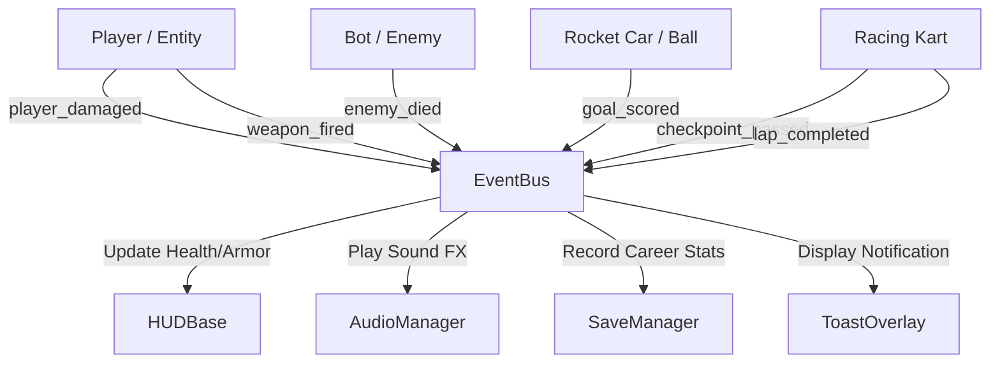

# VoltArena — System Architecture & Design Document

## 1. Architectural Overview

VoltArena is built on a modular, decoupled, single-binary architecture powered by **Godot 4.3 Stable**. The suite utilizes an event-driven pub/sub architecture centered around global singletons, shared foundation libraries, and self-contained game modules.

```
+-------------------------------------------------------------------------+
|                           VOLTARENA LAUNCHER                            |
|             (Cyberpunk 3D Holographic Menu, Mode Switcher)               |
+-------------------------------------------------------------------------+
       |                         |                     |              |
       v                         v                     v              v
+---------------+       +------------------+    +-------------+ +-------------+
| IRON CRUCIBLE |       |   METRO SIEGE    |    | NITRO KICK  | | DRIFT STORM |
| (Arena FPS)   |       | (Wave Survival)  |    | (Rocket-Car)| | (Kart Racing|
+---------------+       +------------------+    +-------------+ +-------------+
       \                         /                     /              /
        \                       /                     /              /
         +----------------------------------------------------------+
         |                 SHARED FOUNDATION SUBSYSTEMS             |
         |----------------------------------------------------------|
         | GameManager       | EventBus          | AssetLoader      |
         | SettingsManager   | SaveManager       | AudioManager     |
         | InputManager      | QualityManager    | PlatformAdapter  |
         | MaterialGenerator | ThemeGenerator    | TelemetryManager |
         +----------------------------------------------------------+
```

---

## 2. Core Autoload Singletons

The engine exposes 10 specialized Autoload singletons registered in `project.godot`:

| Singleton Name | Script Path | Architectural Responsibility |
| :--- | :--- | :--- |
| **`GameManager`** | `shared/core/game_manager.gd` | Global application lifecycle, mode transitions, pause states, and active session coordination. |
| **`EventBus`** | `shared/core/event_bus.gd` | Decoupled publish/subscribe signal hub connecting gameplay events, UI notifications, toasts, and audio triggers. |
| **`SettingsManager`** | `shared/settings/settings_manager.gd` | User preferences: graphics presets (Ultra, High, Medium, Low), FOV, sensitivities, volume buses, and persistent storage. |
| **`SaveManager`** | `shared/save/save_manager.gd` | Encrypted/JSON profile storage tracking career statistics, high scores, wave records, lap times, and currency. |
| **`AudioManager`** | `shared/audio/audio_manager.gd` | Pure algorithmic audio synthesis engine generating 8 procedural sound effect types directly into memory without external WAV/OGG files. |
| **`InputManager`** | `shared/input/input_manager.gd` | Unified input aggregator translating Keyboard, Mouse, Gamepad, and Virtual Touch Joysticks into normalized vector actions. |
| **`QualityManager`** | `shared/graphics/quality_manager.gd` | Runtime viewport scaling, MSAA, shadow resolution, SSAO, glow, and LOD adjustments based on target hardware capabilities. |
| **`PlatformAdapter`** | `shared/platform/platform_adapter.gd` | Hardware abstraction layer detecting Web, Desktop, Mobile, touch screens, and full-screen display modes. |
| **`AssetLoader`** | `shared/loading/asset_loader.gd` | Async resource streaming, preloading, and transition animation coordination. |
| **`TelemetryManager`** | `shared/telemetry/telemetry_manager.gd` | Runtime frame time tracking, memory monitoring, draw call estimation, and performance bottleneck diagnostics. |

---

## 3. Decoupled Pub/Sub Event System (`EventBus`)

The `EventBus` eliminates tight coupling between gameplay entities (players, enemies, vehicles, projectiles) and peripheral systems (HUD, audio, stats):



### Key Event Signatures:
* `player_damaged(hp, armor)`: Instructs HUD to animate health/shield bars and audio to play impact sounds.
* `enemy_died(enemy_type, score)`: Awards score, records stats, and triggers particle effects.
* `goal_scored(team_id)`: Triggers fireworks, arena sirens, score tallying, and kickoff resets.
* `checkpoint_passed(checkpoint_idx, total)`: Advances race progression, calculates split times.
* `show_toast_requested(msg, color)`: Dispatches floating notification overlays.

---

## 4. Production Asset & Material Pipelines

VoltArena balances high-fidelity 3D assets with zero runtime external dependencies through an offline-vendored production asset cache combined with dynamic runtime procedural synthesis:

### 4.1 `ModelCache` (Production 3D Asset Subsystem)
The `ModelCache` singleton (`shared/graphics/model_cache.gd`) provides centralized, optimized loading, caching, and instantiation of production-quality 3D assets:
* **Offline Vendoring**: 49 permissive (MIT / CC0) `.glb` models stored in `res://assets/models/` verified via SHA-256 integrity checksums in `assets/asset-manifest.json`.
* **Resource Caching**: Preloads and caches packed scenes in memory (`_cache[model_key]`) to eliminate redundant disk I/O and frame hitching during runtime spawning.
* **Character Rigs & Animations**: Manages 13 skeletal animation tracks for humanoids (aim, fire, reload, hit react, strafe locomotion, turn in place).
* **Weapons & Vehicles**: Supplies authentic modeled firearms (`pulse_rifle`, `scatter_cannon`, `rail_driver`, `grenade_launcher`, `plasma_cutter`), competition karts, and rocket battle-cars with proper socket linkage.
* **Zero Gameplay Fallbacks**: Replaces all procedural CSG and toy primitive blocks in active gameplay scenes with authentic production geometry.

### 4.2 `MaterialGenerator`
Creates dynamic PBR materials on demand using Godot's `StandardMaterial3D`:
* Generates emissive neon shaders (cyan, orange, magenta, green, yellow) with configurable glow intensities and roughness.
* Generates industrial metals (`dark_hull`, `metal_floor`, `hazard_stripe`) with procedural noise patterns, normal perturbations, and metallic reflections.
* Reuses cached `Ref<StandardMaterial3D>` instances to prevent state changes on the GPU.

### 4.3 `AudioManager` (Procedural Waveform Synthesis)
Generates pure PCM audio buffers in-memory using algorithmic mathematical synthesis:
* **Pulse Laser / Blaster**: Square wave with exponential frequency pitch down-sweep.
* **Shotgun Blast / Explosion**: White noise buffer with aggressive low-pass filtering and rapid amplitude decay envelope.
* **Railgun Beam**: High-frequency sine wave layered with a sub-bass rumble.
* **Engine Rev / Turbo**: Modulated sawtooth waves frequency-scaled by vehicle throttle inputs.
* **Powerup Chime**: Arpeggiated harmonic sine chord.

---

## 5. Collision Layer Matrix

The physics world is partitioned into 10 strict collision layers configured in `project.godot`:

| Layer | Bit | Name | Used By | Collides With |
| :---: | :---: | :--- | :--- | :--- |
| **1** | `1 << 0` | `World` | Walls, floors, barriers, tracks | Players, Enemies, Projectiles, Vehicles, Ball |
| **2** | `1 << 1` | `Player` | FPS Player, Human Kart, Human Car | World, Enemies, Pickups, Ball |
| **3** | `1 << 2` | `Enemies`| FPS Bots, Mutant Crawlers/Brutes | World, Player, Projectiles |
| **4** | `1 << 3` | `Projectiles`| Bullets, Rockets, Missiles | World, Player, Enemies |
| **5** | `1 << 4` | `Pickups` | Health, Armor, Ammo, Item Boxes | Player |
| **6** | `1 << 5` | `Checkpoints`| Racing Gate Sensor Triggers | Player, AI Karts |
| **7** | `1 << 6` | `Goal` | Soccer Net Sensor Volumes | Ball |
| **8** | `1 << 7` | `Ball` | Rocket Football Ball | World, Player, AI Cars, Goal |
| **9** | `1 << 8` | `Hazards` | EMP Mines, Lava, Out-of-bounds | Player, Enemies |
| **10**| `1 << 9` | `Trigger` | Wave spawn areas, Jump pads | Player, Enemies |

---

## 6. Launcher Navigation & State Machine

The top-level `Launcher` (`launcher/launcher.tscn`) acts as the master coordinator:
* Manages 3D holographic title screens, game selection carousels, and persistent settings dialogs.
* Transitions between scenes seamlessly using `GameManager.load_game_scene()`.
* Each game main scene includes a standardized `PauseMenu` that provides "Resume", "Restart Match", and "Quit to Launcher" with zero memory leaks.

---

## 7. Onboarding Overlay & Active Objective Architecture

To guarantee player onboarding clarity across all 4 games, every HUD (`ArenaFPSHUD`, `MetroSiegeHUD`, `NitroKickHUD`, `DriftStormHUD`) implements a standardized onboarding and active objective system:
* **Premise & Controls Overlay**: Instantiated at scene load (`setup_onboarding_overlay()`) presenting title, sub-genre, controls mapping grid, and primary win condition.
* **Automatic & Input Dismissal**: Automatically transitions away via tween alpha fade on match start timer, or immediately on any key/mouse press via `_unhandled_input()`.
* **Persistent Objective Badges**: Top-center pinned banners maintain persistent objective state throughout gameplay (e.g. "RACE TO 20 FRAGS", "SURVIVE 10 WAVES & EXTRACT", "SCORE 3 GOALS IN ORANGE GOAL", "COMPLETE 3 LAPS — FINISH 1ST").

---

## 8. Screen-Space Off-Screen Entity Tracking Architecture

In fast-paced 3D arenas (specifically Nitro Kick for the soccer ball), keeping track of off-screen targets is critical:
* **`set_tracking_targets(cam, ball)`**: Passes the active camera and target entity to the HUD.
* **Camera Projection**: Converts `global_position` via `camera.unproject_position()` and tests `camera.is_position_behind(target_pos)`.
* **Clamping & Direction Vectors**: When off-screen, projects from viewport center along normalized vector to screen border margins with directional arrow rotation (`▲`, `▼`, `◄`, `►`).
* **Dynamic Distance Metric**: Calculates real-time Euclidean distance in meters, displaying e.g. `BALL 24m` directly on the screen-space tracker badge.
