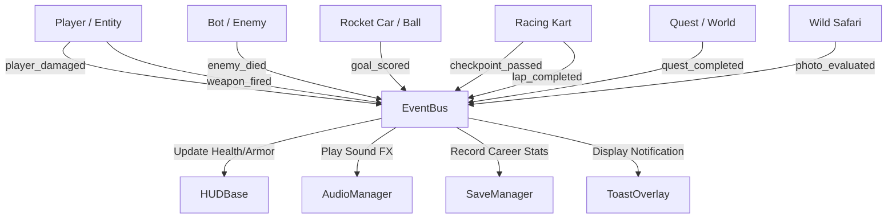

# VoltArena — System Architecture & Design Document

## 1. Architectural Overview

VoltArena is built on a modular, decoupled, single-binary architecture powered by **Godot 4.3 Stable**. The suite utilizes an event-driven pub/sub architecture centered around global singletons, shared foundation libraries, and self-contained game modules.

```
+-------------------------------------------------------------------------------------------------------+
|                                          VOLTARENA LAUNCHER                                           |
|                             (8-Game Responsive Carousel, Hot-Swap Loader)                             |
+-------------------------------------------------------------------------------------------------------+
    |           |            |            |             |              |             |              |
    v           v            v            v             v              v             v              v
+-------+   +-------+   +---------+   +-------+   +-----------+   +----------+   +---------+    +---------+
| IRON  |   | METRO |   |  NITRO  |   | DRIFT |   | SKYBOUND  |   | ROBOFORGE|   |  WILD   |    | STRIKE  |
|CRUCIBLE|  | SIEGE |   |  KICK   |   | STORM |   |  ODYSSEY  |   |  ARENA   |   | CIRCUIT |    | VECTOR  |
| (FPS) |   |(Survival) | (Rocket)|   | (Kart)|   |(Platform) |   | (Sandbox)|   | (Safari)|    |(Campaign|
+-------+   +-------+   +---------+   +-------+   +-----------+   +----------+   +---------+    +---------+
    \           \            \            |            /              /             /              /
     \           \            \           |           /              /             /              /
      +------------------------------------------------------------------------------------------+
      |                               SHARED FOUNDATION SUBSYSTEMS                               |
      |------------------------------------------------------------------------------------------|
      | GameManager       | EventBus          | AssetLoader      | QuestManager    | CameraDir   |
      | SettingsManager   | SaveManager       | AudioManager     | InventorySystem | Checkpoint  |
      | InputManager      | QualityManager    | PlatformAdapter  | OrbitCamera3D   | Streamer    |
      | MaterialGenerator | ThemeGenerator    | TelemetryManager | DayNightCycle3D | EncounterDir|
      | InteractionArea3D | PuzzleElements    | TextureSynth     | ModelCache      | AIArchetypes|
      +------------------------------------------------------------------------------------------+
```

---

## 2. Core Autoload Singletons & Foundation Modules

The engine exposes 10 specialized Autoload singletons and high-level foundation subsystems registered in `project.godot`:

| Singleton / Module | Path | Architectural Responsibility |
| :--- | :--- | :--- |
| **`GameManager`** | `shared/core/game_manager.gd` | Global application lifecycle, mode transitions, pause states, and active session coordination. |
| **`EventBus`** | `shared/core/event_bus.gd` | Decoupled publish/subscribe signal hub connecting gameplay events, UI notifications, toasts, and audio triggers. |
| **`SettingsManager`** | `shared/settings/settings_manager.gd` | User preferences: graphics presets (Ultra, High, Medium, Low), FOV, sensitivities, volume buses, and persistent storage. |
| **`SaveManager`** | `shared/save/save_manager.gd` | Encrypted/JSON profile storage tracking career statistics, high scores, wave records, lap times, and currency. |
| **`AudioManager`** | `shared/audio/audio_manager.gd` | Pure algorithmic audio synthesis engine generating procedural sound effect types directly into memory without external audio files. |
| **`InputManager`** | `shared/input/input_manager.gd` | Unified input aggregator translating Keyboard, Mouse, Gamepad, and Virtual Touch Joysticks into normalized vector actions. |
| **`QualityManager`** | `shared/graphics/quality_manager.gd` | Runtime viewport scaling, MSAA, shadow resolution, SSAO, glow, and LOD adjustments based on target hardware capabilities. |
| **`PlatformAdapter`** | `shared/platform/platform_adapter.gd` | Hardware abstraction layer detecting Web, Desktop, Mobile, touch screens, and full-screen display modes. |
| **`AssetLoader`** | `shared/loading/asset_loader.gd` | Async resource streaming, preloading, and transition animation coordination. |
| **`TelemetryManager`** | `shared/telemetry/telemetry_manager.gd` | Runtime frame time tracking, memory monitoring, draw call estimation, and performance bottleneck diagnostics. |
| **`QuestManager`** | `shared/gameplay/quest_system.gd` | Multi-stage objective tracking, prerequisites enforcement, stage completion signals, and state serialization. |
| **`InventorySystem`** | `shared/gameplay/inventory_system.gd` | Grid/stack inventory, item weights, equipment slots, and traversal gear unlock management. |
| **`OrbitCamera3D`** | `shared/cameras/orbit_camera.gd` | Spring-arm raycasting collision avoidance, mouse/gamepad rotation, pitch clamping, and distance zoom. |
| **`DayNightCycle3D`** | `shared/environment/day_night_cycle.gd` | 24-hour celestial orbit, directional sun/moon rotation, ambient color grading, and shadow transitions. |
| **`PuzzleElements`** | `shared/gameplay/puzzle_elements.gd` | Physics pressure plates, interactive switches, locked puzzle doors, wind lift currents, and grapple anchors. |
| **`InteractionArea3D`** | `shared/gameplay/interaction_area.gd` | Reusable 3D proximity trigger with prompt billboard and interaction signal dispatch. |

---

## 3. Decoupled Pub/Sub Event System (`EventBus`)

The `EventBus` eliminates tight coupling between gameplay entities (players, enemies, vehicles, projectiles) and peripheral systems (HUD, audio, stats):



### Key Event Signatures:
* `player_damaged(hp, armor)`: Instructs HUD to animate health/shield bars and audio to play impact sounds.
* `enemy_died(enemy_type, score)`: Awards score, records stats, and triggers particle effects.
* `goal_scored(team_id)`: Triggers fireworks, arena sirens, score tallying, and kickoff resets.
* `checkpoint_passed(checkpoint_idx, total)`: Advances race progression, calculates split times.
* `quest_completed(quest_id)`: Unlocks downstream objectives and progression rewards.
* `photo_evaluated(score_data)`: Updates journal entries and triggers shutter feedback.
* `show_toast_requested(msg, color)`: Dispatches floating notification overlays.

---

## 4. Production Asset & Material Pipelines

VoltArena balances high-fidelity 3D assets with zero runtime external dependencies through an offline-vendored production asset cache combined with dynamic runtime procedural synthesis:

### 4.1 `ModelCache` (Production 3D Asset Subsystem)
The `ModelCache` singleton (`shared/graphics/model_cache.gd`) provides centralized, optimized loading, caching, and instantiation of production-quality 3D assets:
* **Offline Vendoring**: 49 permissive (MIT / CC0) `.glb` models stored in `res://assets/models/` verified via SHA-256 integrity checksums in `assets/asset-manifest.json`.
* **Resource Caching**: Preloads and caches packed scenes in memory (`_cache[model_key]`) to eliminate redundant disk I/O and frame hitching during runtime spawning.
* **Character Rigs & Animations**: Manages 13 skeletal animation tracks for humanoids (aim, fire, reload, hit react, strafe locomotion, turn in place).
* **Weapons & Vehicles**: Supplies modeled firearms (`pulse_rifle`, `scatter_cannon`, `rail_driver`, `grenade_launcher`, `plasma_cutter`), competition karts, and rocket battle-cars with socket linkage.
* **Zero Gameplay Fallbacks**: Replaces procedural CSG and raw blockout placeholders in active gameplay scenes with authentic production geometry.

### 4.2 `MaterialGenerator`
Creates dynamic PBR materials on demand using Godot's `StandardMaterial3D`:
* Generates 18 specialized procedural PBR materials including metals (`dark_hull`, `metal_floor`, `hazard_stripe`), terrain (`rock_face`, `mossy_stone`, `temple_gold`, `snow_ground`, `ice_crystal`), energy grids, and organic surfaces.
* Reuses cached `Ref<StandardMaterial3D>` instances to prevent state changes on the GPU.

### 4.3 `AudioManager` (Procedural Waveform Synthesis)
Generates pure PCM audio buffers in-memory using algorithmic mathematical synthesis:
* **Pulse Laser / Blaster**: Square wave with exponential frequency pitch down-sweep.
* **Shotgun Blast / Explosion**: White noise buffer with aggressive low-pass filtering and rapid amplitude decay envelope.
* **Railgun Beam**: High-frequency sine wave layered with a sub-bass rumble.
* **Engine Rev / Turbo**: Modulated sawtooth waves frequency-scaled by vehicle throttle inputs.
* **Glider / Wind**: Filtered pink noise with velocity-driven resonance.
* **Camera Shutter**: Crisp dual-click mechanical transient.

---

## 5. Collision Layer Matrix

The physics world is partitioned into 12 strict collision layers configured in `project.godot`:

| Layer | Bit | Name | Used By | Collides With |
| :---: | :---: | :--- | :--- | :--- |
| **1** | `1 << 0` | `World` | Walls, floors, barriers, terrain, platforms | Players, Enemies, Projectiles, Vehicles, Ball, Wildlife |
| **2** | `1 << 1` | `Player` | FPS Player, Kart, Car, Platformer Player, ATV | World, Enemies, Pickups, Ball, Hazards, Triggers |
| **3** | `1 << 2` | `Enemies`| FPS Bots, Mutant Crawlers/Brutes | World, Player, Projectiles |
| **4** | `1 << 3` | `Projectiles`| Bullets, Rockets, Missiles, Acid Spits | World, Player, Enemies |
| **5** | `1 << 4` | `Pickups` | Health, Armor, Ammo, Shards, Items | Player |
| **6** | `1 << 5` | `Checkpoints`| Racing Gate Sensors, Adventure Checkpoints | Player, AI Karts |
| **7** | `1 << 6` | `Goal` | Soccer Net Sensor Volumes | Ball |
| **8** | `1 << 7` | `Ball` | Rocket Football Ball | World, Player, AI Cars, Goal |
| **9** | `1 << 8` | `Hazards` | EMP Mines, Lava, Out-of-bounds, Abysses | Player, Enemies |
| **10**| `1 << 9` | `Trigger` | Wave spawn areas, Jump pads, Pressure plates | Player, Enemies, Blocks |
| **11**| `1 << 10`| `Interact` | NPCs, Switches, Kiosks, Examination Points | Player |
| **12**| `1 << 11`| `Wildlife` | Safari Animals (Gazelle, Lion, Macaw, etc.) | World, Player, ATV |

---

## 6. Game Subsystem Architectures

### 6.1 Skybound Odyssey (Open-Air 3D Platformer)
* **Kinematics Engine (`SkyCharacter`)**: CharacterBody3D implementing variable jumping, double jumping, raycast-based ledge mantling, glider aerodynamics with drag/lift polar curves, and physical grapple cable retraction. Includes safe-transform tracking and abyss kill-plane recovery at $Y < -40.0\text{m}$.
* **5-Region World (`SkyboundWorld`)**: Spatial partition dividing the open world into Emerald Isles ($Y=0$), Crystal Caverns ($Y=-25$), Sunken Sky Temple ($Y=12$), Frost Peaks ($Y=24$), and Storm Citadel ($Y=40$) with height-transitioned updrafts and lockable portals.
* **Quest & Shard Director**: Interfaces with `QuestManager` to guide the player through 5 core regional storylines while tracking 25 collectible sky shards.

### 6.2 RoboForge Arena (Modular Physics Construction Sandbox)
* **3D Workshop Bay (`Workshop3D`)**: Real-time turntable inspection bay featuring 360° camera orbit, module snapping points, and dynamic chassis re-meshing.
* **Modular Assembly Engine (`ModularRobot`)**: Aggregates chassis, locomotion drives, power reactors, and functional tools into a unified physical CharacterBody3D. Recalculates total mass, center of mass, motor torque, top speed, and energy draw dynamically:
  $$\text{Speed} = \frac{\text{Base Drive Speed} \times \text{Core Power Output}}{\text{Total Mass}}$$
* **Challenge Orchestrator (`ChallengeManager`)**: Manages 7 specialized physical trial courses with milestone checkpoints, cargo damage detection, and medal qualification thresholds.

### 6.3 WildCircuit (Wildlife Safari & Photography Traversal)
* **Biome Manager (`WildBiomes`)**: Instantiates 5 distinct ecosystem biomes (Savanna, Rainforest, Alpine, Coastal, Wetlands) featuring procedural terrain, localized vegetation clusters, and natural water bodies.
* **Wildlife Behavioral Engine (`AnimalBase`)**: 8-state finite state machine (Grazing, Alert, Fleeing, Hunting, Resting, Drinking, Socializing, Vocalizing) with perception cones, flight distances, and predator-prey dynamics across 9 species.
* **Optical Viewfinder System (`CameraMode`)**: Simulates 24mm to 300mm optical zoom with depth-of-field blur, rule-of-thirds composition guidelines, subject focus distance, and shutter feedback.
* **Deterministic Photo Scorer**: Evaluates photo captures mathematically:
  $$\text{Score} = \text{Base Rarity} \times \text{Framing Multiplier} \times \text{Distance Factor} \times \text{Action State Bonus}$$
* **Field Journal (`FieldJournal`)**: Serialized catalog documenting species descriptions, behavior milestones, high-scoring photo captures, and star ratings.
* **Expedition ATV (`ExplorerATV`)**: Physical traversal vehicle with independent 4-wheel suspension simulation, steering geometry, turbo boost, and terrain climbing capability.

### 6.4 Strike Vector (Forward-Moving 3D Run-and-Gun Campaign)
* **Forward Locomotion & Kinematics (`StrikePlayer` & `PlayerLocomotion`)**: CharacterBody3D locomotion implementing camera-relative navigation ($W \rightarrow +cam\_fwd$), sprint ($9.2\text{ m/s}$), slide, crouch, dodge roll, ledge mantling, variable jump with 0.15s coyote and jump buffering, and anti-fall recovery (`recover_to_safe_ground()` with floor snap $0.45\text{m}$ and safe margin $0.08\text{m}$). Facing orientation smoothly interpolates to velocity (`atan2(-vx, -vz)`) during traversal, and locks to camera yaw during combat.
* **Transform & Rig Architecture (`ModelCache` & `StrikePlayerVisual`)**: Resolves Mixamo keyframe unit and coordinate discrepancies:
  - Normalizes `mixamorig_Hips` position tracks from meters to centimeters ($val.x \times 100, -val.z \times 100, val.y \times 100$), ensuring upright skeletal posture ($1.02\text{m}$ shooting height).
  - Upper-Body Track Filtering: In `_normalize_rig_tracks()`, completely strips `mixamorig_Hips` and leg bone tracks from combat animations (`aim`, `fire`, `reload`, `hit`, `shoot`), restricting recoil/aim/reload animations strictly to `mixamorig_Spine` and descendant bones. This guarantees that CharacterBody3D and root hip transforms are never modified by firing, eliminating horizontal "sleeping" poses and maintaining `min_up_dot = 1.0` across 100+ consecutive shots.
  - Binds a `BoneAttachment3D` to `mixamorig_RightHand` containing child `WeaponGrip` scaled $\times 100.0$ and rotated $Vector3(90.0, 90.0, 0.0)$ with palm offset `Vector3(0.04, -0.02, 0.05)` to maintain true human scale and forward barrel alignment down-range along $-Z$ ($0.027^\circ$ angular error).
* **World Metric Scale Convention (`StrikeEnvironmentBuilder`)**: Enforces 1 Godot unit = 1 metre project standard:
  - Human operative collision capsule: height $1.80\text{m}$, radius $0.40\text{m}$.
  - Vehicles: Replaced miniature toy go-kart with authentic patrol cruiser `rocket_car_enforcer.glb` at scale $1.6$ ($4.56\text{m} \times 2.08\text{m} \times 2.0\text{m}$) and heavy trucks at scale $2.2$ ($6.16\text{m} \times 3.3\text{m} \times 3.19\text{m}$).
  - Street Canyon: Roadway widened to 14m two-lane street with 3.5m sidewalks ($21.0\text{m}$ total canyon width), enclosed by $14\text{m}\text{--}24\text{m}$ multi-story buildings with physical box colliders.
* **Physical Combat & Hit Registration Pipeline (`WeaponProjectile` & `StrikePlayer`)**:
  - `WeaponProjectile` implements continuous raycast sweep to prevent high-speed tunneling through dynamic targets.
  - Corrected GDScript boolean precedence for `shooter_name: String`, eliminating runtime script error on hit.
  - Explicit collision layer assignments: `LAYER_PLAYER = 2`, `LAYER_ENEMIES = 4`, `LAYER_WORLD = 1`. Projectile queries exclude the shooter RID.
  - Damage resolution: Energy shield absorbs 60% of damage, and HP absorbs remaining 40%. Fires `damage_taken` signal with dealer name string, weapon name, and 3D hit position.
  - Solid world obstacles (`StaticBody3D` with `LAYER_WORLD`) intercept and destroy non-penetrating projectiles with zero bleed-through to entities behind cover.
* **Threat Readability & Directional Damage Feedback (`StrikeDirectionalDamageIndicator` & `StrikeHUD`)**:
  - Calculates the angular bearing between the camera forward vector and incoming attacker position in screen space.
  - Renders dynamic glowing red/amber threat arcs around the reticle with exponential fade out, accompanied by a red peripheral vignette screen pulse on damage.
* **Async Mission Streaming (`MissionStreamer` & `SegmentManager`)**: Coordinates multi-segment mission streaming keeping active + next segments resident in memory (`LOCKED -> PRELOADED -> ACTIVE -> COMPLETE -> EXITED -> UNLOADED`) to eliminate void transitions and prevent memory leaks.
* **AI Navigation Mesh (`StrikeEnvironmentBuilder`)**: Programmatically constructs deterministic `NavigationRegion3D` and `NavigationMesh` instances across roadways and sidewalks for all 8 campaign biomes, driving active enemy patrol, flank, cover, and chase behaviors via `NavigationAgent3D`.
* **Standardized Weapon Sockets & Crosshair Convergence (`StrikeWeaponBase` & `StrikeWeaponArsenal`)**: Features 9 production firearms (VX-7, Tempest, Breach, Atlas, Longshot, Cyclone, Arc Launcher, Pulse Cannon, Tactical Sidearm) with 5 standardized sockets (`MuzzleSocket`, `MagazineSocket`, `ScopeSocket`, `ShellEjectionSocket`, `LeftHandIKTarget`). Implements camera crosshair 3D raycast convergence so muzzle projectile velocity aims toward the reticle target point rather than clipping nearby railings.
* **10 Enemy Archetypes & Squad Coordinator (`AIArchetypes`, `StrikeAIBase`, `SquadCoordinator`)**: BehaviorTree/HFSM covering Rifle Trooper, Rusher, Heavy, Marksman, Shield, Grenadier, Drone, Turret, Elite, and Commander with token-based attack concurrency.
* **Multi-Phase Boss Framework (`StrikeBossBase` & `BossArchetypes`)**: 8 distinct mission bosses with telegraph warnings, attack patterns, shield defense, weakness exposure windows, and multi-phase transformations.
* **Dynamic Camera System (`CameraDirector`)**: 7 camera modes (Third-person, ADS, 2.5D side-scroller, corridor chase, vehicle, boss, cinematic) with collision-avoiding spring arm and mouse capture toggle.
* **Tactical Navigation HUD (`StrikeHUD`)**: Features top-center `StrikeCompassTape` with dynamic objective diamond bearing and meter distance, top-right `StrikeMinimap` radar with player forward chevron and threat-aware fading hostile blips ($3.0\text{s}$ fade), full-screen `StrikeTacticalMap` ($M$ key toggle modal), dynamic crosshair with hit indicators, directional threat arcs, and vitals/weapon readouts with fire mode display.
* **Checkpoint & Save Persistence (`CheckpointManager`)**: Real-time checkpoint registration, safe-ground respawn restoration, and career mission grading persistence.

---

## 7. Universal Launcher Architecture

The top-level `Launcher` (`launcher/launcher.tscn`) acts as the master coordinator:
* **8-Game Carousel**: Responsive horizontal/grid card layout supporting keyboard, gamepad, and mouse navigation across all 8 titles.
* **State & Metadata Preview**: Displays title, genre tags, active controls, description, career records, and visual dossier for the highlighted game.
* **Hot-Swap Engine**: Uses `GameManager.load_game_scene()` for asynchronous resource streaming and clean garbage collection during transitions.
* **Universal In-Game Pause & Overlay**: Every game includes a unified `PauseMenu` that provides "Resume", "Restart", and "Quit to Launcher" with zero memory leaks.
