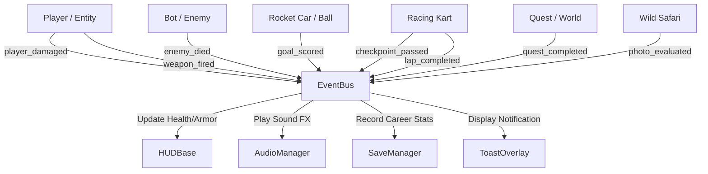
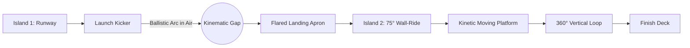

# VoltArena — System Architecture & Design Document

## 1. Architectural Overview

VoltArena is built on a modular, decoupled, single-binary architecture powered by **Godot 4.3 Stable**. The suite utilizes an event-driven pub/sub architecture centered around global singletons, shared foundation libraries, and self-contained game modules.

```
+-------------------------------------------------------------------------------------------------------------------------------+
|                                                       VOLTARENA LAUNCHER                                                      |
|                                         (10-Game Responsive Carousel, Hot-Swap Loader)                                        |
+-------------------------------------------------------------------------------------------------------------------------------+
    |         |          |          |          |           |            |           |             |               |
    v         v          v          v          v           v            v           v             v               v
+-------+ +-------+ +---------+ +-------+ +---------+ +----------+ +---------+ +---------+ +-------------+ +-------------+
| IRON  | | METRO | |  NITRO  | | DRIFT | |SKYBOUND | |ROBOFORGE | |  WILD   | | STRIKE  | | CHROMA RUSH | |  AERO RUSH  |
|CRUCIBL| | SIEGE | |  KICK   | | STORM | | ODYSSEY | |  ARENA   | | CIRCUIT | | VECTOR  | | (The Color  | | (Impossible |
| (FPS) | |(Surv) | | (Rocket)| | (Kart)| |(Platform| | (Sandbox)| | (Safari)| |(Campaign| |    Chase)   | |   Circuit)  |
+-------+ +-------+ +---------+ +-------+ +---------+ +----------+ +---------+ +---------+ +-------------+ +-------------+
    \           \            \            |            /              /             /              /              /
     \           \            \           |           /              /             /              /              /
      +----------------------------------------------------------------------------------------------------------+
      |                               SHARED FOUNDATION SUBSYSTEMS                               |
      |------------------------------------------------------------------------------------------|
      | GameManager       | EventBus          | AssetLoader      | QuestManager    | CameraDir   |
      | SettingsManager   | SaveManager       | AudioManager     | InventorySystem | Checkpoint  |
      | InputManager      | QualityManager    | PlatformAdapter  | OrbitCamera3D   | Streamer    |
      | MaterialGenerator | ThemeGenerator    | TelemetryManager | DayNightCycle3D | EncounterDir|
      | InteractionArea3D | PuzzleElements    | TextureSynth     | ModelCache      | AIArchetypes|
      +------------------------------------------------------------------------------------------+
```

---

## 2. Core Autoload Singletons & Foundation Modules

The engine exposes 10 specialized Autoload singletons and high-level foundation subsystems registered in `project.godot`:

| Singleton / Module | Path | Architectural Responsibility |
| :--- | :--- | :--- |
| **`GameManager`** | `shared/core/game_manager.gd` | Global application lifecycle, mode transitions, pause states, and active session coordination. |
| **`EventBus`** | `shared/core/event_bus.gd` | Decoupled publish/subscribe signal hub connecting gameplay events, UI notifications, toasts, and audio triggers. |
| **`SettingsManager`** | `shared/settings/settings_manager.gd` | User preferences: graphics presets (Ultra, High, Medium, Low), FOV, sensitivities, volume buses, and persistent storage. |
| **`SaveManager`** | `shared/save/save_manager.gd` | Encrypted/JSON profile storage tracking career statistics, high scores, wave records, lap times, and currency. |
| **`AudioManager`** | `shared/audio/audio_manager.gd` | Pure algorithmic audio synthesis engine generating procedural sound effect types directly into memory without external audio files. |
| **`InputManager`** | `shared/input/input_manager.gd` | Unified input aggregator translating Keyboard, Mouse, Gamepad, and Virtual Touch Joysticks into normalized vector actions. |
| **`QualityManager`** | `shared/graphics/quality_manager.gd` | Runtime viewport scaling, MSAA, shadow resolution, SSAO, glow, and LOD adjustments based on target hardware capabilities. |
| **`PlatformAdapter`** | `shared/platform/platform_adapter.gd` | Hardware abstraction layer detecting Web, Desktop, Mobile, touch screens, and full-screen display modes. |
| **`AssetLoader`** | `shared/loading/asset_loader.gd` | Async resource streaming, preloading, and transition animation coordination. |
| **`TelemetryManager`** | `shared/telemetry/telemetry_manager.gd` | Runtime frame time tracking, memory monitoring, draw call estimation, and performance bottleneck diagnostics. |
| **`QuestManager`** | `shared/gameplay/quest_system.gd` | Multi-stage objective tracking, prerequisites enforcement, stage completion signals, and state serialization. |
| **`InventorySystem`** | `shared/gameplay/inventory_system.gd` | Grid/stack inventory, item weights, equipment slots, and traversal gear unlock management. |
| **`OrbitCamera3D`** | `shared/cameras/orbit_camera.gd` | Spring-arm raycasting collision avoidance, mouse/gamepad rotation, pitch clamping, and distance zoom. |
| **`DayNightCycle3D`** | `shared/environment/day_night_cycle.gd` | 24-hour celestial orbit, directional sun/moon rotation, ambient color grading, and shadow transitions. |
| **`PuzzleElements`** | `shared/gameplay/puzzle_elements.gd` | Physics pressure plates, interactive switches, locked puzzle doors, wind lift currents, and grapple anchors. |
| **`InteractionArea3D`** | `shared/gameplay/interaction_area.gd` | Reusable 3D proximity trigger with prompt billboard and interaction signal dispatch. |

---

## 3. Decoupled Pub/Sub Event System (`EventBus`)

The `EventBus` eliminates tight coupling between gameplay entities (players, enemies, vehicles, projectiles) and peripheral systems (HUD, audio, stats):


```mermaid
graph TD
    Player[Player / Entity] -->|player_damaged| EB[EventBus]
    Player -->|weapon_fired| EB
    Bot[Bot / Enemy] -->|enemy_died| EB
    Car[Rocket Car / Ball] -->|goal_scored| EB
    Kart[Racing Kart] -->|checkpoint_passed| EB
    Kart -->|lap_completed| EB
    Quest[Quest / World] -->|quest_completed| EB
    Safari[Wild Safari] -->|photo_evaluated| EB

    EB -->|Update Health/Armor| HUD[HUDBase]
    EB -->|Play Sound FX| Audio[AudioManager]
    EB -->|Record Career Stats| Save[SaveManager]
    EB -->|Display Notification| Toast[ToastOverlay]
```

### Key Event Signatures:
* `player_damaged(hp, armor)`: Instructs HUD to animate health/shield bars and audio to play impact sounds.
* `enemy_died(enemy_type, score)`: Awards score, records stats, and triggers particle effects.
* `goal_scored(team_id)`: Triggers fireworks, arena sirens, score tallying, and kickoff resets.
* `checkpoint_passed(checkpoint_idx, total)`: Advances race progression, calculates split times.
* `quest_completed(quest_id)`: Unlocks downstream objectives and progression rewards.
* `photo_evaluated(score_data)`: Updates journal entries and triggers shutter feedback.
* `show_toast_requested(msg, color)`: Dispatches floating notification overlays.

---

## 4. Production Asset & Material Pipelines

VoltArena balances high-fidelity 3D assets with zero runtime external dependencies through an offline-vendored production asset cache combined with dynamic runtime procedural synthesis:

### 4.1 `ModelCache` (Production 3D Asset Subsystem)
The `ModelCache` singleton (`shared/graphics/model_cache.gd`) provides centralized, optimized loading, caching, and instantiation of production-quality 3D assets:
* **Offline Vendoring**: 49 permissive (MIT / CC0) `.glb` models stored in `res://assets/models/` verified via SHA-256 integrity checksums in `assets/asset-manifest.json`.
* **Resource Caching**: Preloads and caches packed scenes in memory (`_cache[model_key]`) to eliminate redundant disk I/O and frame hitching during runtime spawning.
* **Character Rigs & Animations**: Manages 13 skeletal animation tracks for humanoids (aim, fire, reload, hit react, strafe locomotion, turn in place).
* **Weapons & Vehicles**: Supplies modeled firearms (`pulse_rifle`, `scatter_cannon`, `rail_driver`, `grenade_launcher`, `plasma_cutter`), competition karts, and rocket battle-cars with socket linkage.
* **Zero Gameplay Fallbacks**: Replaces procedural CSG and raw blockout placeholders in active gameplay scenes with authentic production geometry.

### 4.2 `MaterialGenerator`
Creates dynamic PBR materials on demand using Godot's `StandardMaterial3D`:
* Generates 18 specialized procedural PBR materials including metals (`dark_hull`, `metal_floor`, `hazard_stripe`), terrain (`rock_face`, `mossy_stone`, `temple_gold`, `snow_ground`, `ice_crystal`), energy grids, and organic surfaces.
* Reuses cached `Ref<StandardMaterial3D>` instances to prevent state changes on the GPU.

### 4.3 `AudioManager` (Procedural Waveform Synthesis)
Generates pure PCM audio buffers in-memory using algorithmic mathematical synthesis:
* **Pulse Laser / Blaster**: Square wave with exponential frequency pitch down-sweep.
* **Shotgun Blast / Explosion**: White noise buffer with aggressive low-pass filtering and rapid amplitude decay envelope.
* **Railgun Beam**: High-frequency sine wave layered with a sub-bass rumble.
* **Engine Rev / Turbo**: Modulated sawtooth waves frequency-scaled by vehicle throttle inputs.
* **Glider / Wind**: Filtered pink noise with velocity-driven resonance.
* **Camera Shutter**: Crisp dual-click mechanical transient.

---

## 5. Collision Layer Matrix

The physics world is partitioned into 12 strict collision layers configured in `project.godot`:

| Layer | Bit | Name | Used By | Collides With |
| :---: | :---: | :--- | :--- | :--- |
| **1** | `1 << 0` | `World` | Walls, floors, barriers, terrain, platforms | Players, Enemies, Projectiles, Vehicles, Ball, Wildlife |
| **2** | `1 << 1` | `Player` | FPS Player, Kart, Car, Platformer Player, ATV | World, Enemies, Pickups, Ball, Hazards, Triggers |
| **3** | `1 << 2` | `Enemies`| FPS Bots, Mutant Crawlers/Brutes | World, Player, Projectiles |
| **4** | `1 << 3` | `Projectiles`| Bullets, Rockets, Missiles, Acid Spits | World, Player, Enemies |
| **5** | `1 << 4` | `Pickups` | Health, Armor, Ammo, Shards, Items | Player |
| **6** | `1 << 5` | `Checkpoints`| Racing Gate Sensors, Adventure Checkpoints | Player, AI Karts |
| **7** | `1 << 6` | `Goal` | Soccer Net Sensor Volumes | Ball |
| **8** | `1 << 7` | `Ball` | Rocket Football Ball | World, Player, AI Cars, Goal |
| **9** | `1 << 8` | `Hazards` | EMP Mines, Lava, Out-of-bounds, Abysses | Player, Enemies |
| **10**| `1 << 9` | `Trigger` | Wave spawn areas, Jump pads, Pressure plates | Player, Enemies, Blocks |
| **11**| `1 << 10`| `Interact` | NPCs, Switches, Kiosks, Examination Points | Player |
| **12**| `1 << 11`| `Wildlife` | Safari Animals (Gazelle, Lion, Macaw, etc.) | World, Player, ATV |

---

## 6. Game Subsystem Architectures

### 6.1 Skybound Odyssey (Open-Air 3D Platformer)
* **Kinematics Engine (`SkyCharacter`)**: CharacterBody3D implementing variable jumping, double jumping, raycast-based ledge mantling, glider aerodynamics with drag/lift polar curves, and physical grapple cable retraction. Includes safe-transform tracking and abyss kill-plane recovery at $Y < -40.0\text{m}$.
* **5-Region World (`SkyboundWorld`)**: Spatial partition dividing the open world into Emerald Isles ($Y=0$), Crystal Caverns ($Y=-25$), Sunken Sky Temple ($Y=12$), Frost Peaks ($Y=24$), and Storm Citadel ($Y=40$) with height-transitioned updrafts and lockable portals.
* **Quest & Shard Director**: Interfaces with `QuestManager` to guide the player through 5 core regional storylines while tracking 25 collectible sky shards.

### 6.2 RoboForge Arena (Modular Physics Construction Sandbox)
* **3D Workshop Bay (`Workshop3D`)**: Real-time turntable inspection bay featuring 360° camera orbit, module snapping points, and dynamic chassis re-meshing.
* **Modular Assembly Engine (`ModularRobot`)**: Aggregates chassis, locomotion drives, power reactors, and functional tools into a unified physical CharacterBody3D. Recalculates total mass, center of mass, motor torque, top speed, and energy draw dynamically:
  $$\text{Speed} = \frac{\text{Base Drive Speed} \times \text{Core Power Output}}{\text{Total Mass}}$$
* **Challenge Orchestrator (`ChallengeManager`)**: Manages 7 specialized physical trial courses with milestone checkpoints, cargo damage detection, and medal qualification thresholds.

### 6.3 WildCircuit (Wildlife Safari & Photography Traversal)
* **Biome Manager (`WildBiomes`)**: Instantiates 5 distinct ecosystem biomes (Savanna, Rainforest, Alpine, Coastal, Wetlands) featuring procedural terrain, localized vegetation clusters, and natural water bodies.
* **Wildlife Behavioral Engine (`AnimalBase`)**: 8-state finite state machine (Grazing, Alert, Fleeing, Hunting, Resting, Drinking, Socializing, Vocalizing) with perception cones, flight distances, and predator-prey dynamics across 9 species.
* **Optical Viewfinder System (`CameraMode`)**: Simulates 24mm to 300mm optical zoom with depth-of-field blur, rule-of-thirds composition guidelines, subject focus distance, and shutter feedback.
* **Deterministic Photo Scorer**: Evaluates photo captures mathematically:
  $$\text{Score} = \text{Base Rarity} \times \text{Framing Multiplier} \times \text{Distance Factor} \times \text{Action State Bonus}$$
* **Field Journal (`FieldJournal`)**: Serialized catalog documenting species descriptions, behavior milestones, high-scoring photo captures, and star ratings.
* **Expedition ATV (`ExplorerATV`)**: Physical traversal vehicle with independent 4-wheel suspension simulation, steering geometry, turbo boost, and terrain climbing capability.

### 6.4 Strike Vector (Forward-Moving 3D Run-and-Gun Campaign)
* **Forward Locomotion & Kinematics (`StrikePlayer` & `PlayerLocomotion`)**: CharacterBody3D locomotion implementing camera-relative navigation ($W \rightarrow +cam\_fwd$), sprint ($9.2\text{ m/s}$), slide, crouch, dodge roll, ledge mantling, variable jump with 0.15s coyote and jump buffering, and anti-fall recovery (`recover_to_safe_ground()` with floor snap $0.45\text{m}$ and safe margin $0.08\text{m}$). Facing orientation smoothly interpolates to velocity (`atan2(-vx, -vz)`) during traversal, and locks to camera yaw during combat.
* **Transform & Rig Architecture (`ModelCache` & `StrikePlayerVisual`)**: Resolves Mixamo keyframe unit and coordinate discrepancies:
  - Normalizes `mixamorig_Hips` position tracks from meters to centimeters ($val.x \times 100, -val.z \times 100, val.y \times 100$), ensuring upright skeletal posture ($1.02\text{m}$ shooting height).
  - Upper-Body Track Filtering: In `_normalize_rig_tracks()`, completely strips `mixamorig_Hips` and leg bone tracks from combat animations (`aim`, `fire`, `reload`, `hit`, `shoot`), restricting recoil/aim/reload animations strictly to `mixamorig_Spine` and descendant bones. This guarantees that CharacterBody3D and root hip transforms are never modified by firing, eliminating horizontal "sleeping" poses and maintaining `min_up_dot = 1.0` across 100+ consecutive shots.
  - Binds a `BoneAttachment3D` to `mixamorig_RightHand` containing child `WeaponGrip` scaled $\times 100.0$ and rotated $Vector3(90.0, 90.0, 0.0)$ with palm offset `Vector3(0.04, -0.02, 0.05)` to maintain true human scale and forward barrel alignment down-range along $-Z$ ($0.027^\circ$ angular error).
* **World Metric Scale Convention (`StrikeEnvironmentBuilder`)**: Enforces 1 Godot unit = 1 metre project standard:
  - Human operative collision capsule: height $1.80\text{m}$, radius $0.40\text{m}$.
  - Vehicles: Replaced miniature toy go-kart with authentic patrol cruiser `rocket_car_enforcer.glb` at scale $1.6$ ($4.56\text{m} \times 2.08\text{m} \times 2.0\text{m}$) and heavy trucks at scale $2.2$ ($6.16\text{m} \times 3.3\text{m} \times 3.19\text{m}$).
  - Street Canyon: Roadway widened to 14m two-lane street with 3.5m sidewalks ($21.0\text{m}$ total canyon width), enclosed by $14\text{m}\text{--}24\text{m}$ multi-story buildings with physical box colliders.
* **Physical Combat & Hit Registration Pipeline (`WeaponProjectile` & `StrikePlayer`)**:
  - `WeaponProjectile` implements continuous raycast sweep to prevent high-speed tunneling through dynamic targets.
  - Corrected GDScript boolean precedence for `shooter_name: String`, eliminating runtime script error on hit.
  - Explicit collision layer assignments: `LAYER_PLAYER = 2`, `LAYER_ENEMIES = 4`, `LAYER_WORLD = 1`. Projectile queries exclude the shooter RID.
  - Damage resolution: Energy shield absorbs 60% of damage, and HP absorbs remaining 40%. Fires `damage_taken` signal with dealer name string, weapon name, and 3D hit position.
  - Solid world obstacles (`StaticBody3D` with `LAYER_WORLD`) intercept and destroy non-penetrating projectiles with zero bleed-through to entities behind cover.
* **Threat Readability & Directional Damage Feedback (`StrikeDirectionalDamageIndicator` & `StrikeHUD`)**:
  - Calculates the angular bearing between the camera forward vector and incoming attacker position in screen space.
  - Renders dynamic glowing red/amber threat arcs around the reticle with exponential fade out, accompanied by a red peripheral vignette screen pulse on damage.
* **Async Mission Streaming (`MissionStreamer` & `SegmentManager`)**: Coordinates multi-segment mission streaming keeping active + next segments resident in memory (`LOCKED -> PRELOADED -> ACTIVE -> COMPLETE -> EXITED -> UNLOADED`) to eliminate void transitions and prevent memory leaks.
* **AI Navigation Mesh (`StrikeEnvironmentBuilder`)**: Programmatically constructs deterministic `NavigationRegion3D` and `NavigationMesh` instances across roadways and sidewalks for all 8 campaign biomes, driving active enemy patrol, flank, cover, and chase behaviors via `NavigationAgent3D`.
* **Standardized Weapon Sockets & Crosshair Convergence (`StrikeWeaponBase` & `StrikeWeaponArsenal`)**: Features 9 production firearms (VX-7, Tempest, Breach, Atlas, Longshot, Cyclone, Arc Launcher, Pulse Cannon, Tactical Sidearm) with 5 standardized sockets (`MuzzleSocket`, `MagazineSocket`, `ScopeSocket`, `ShellEjectionSocket`, `LeftHandIKTarget`). Implements camera crosshair 3D raycast convergence so muzzle projectile velocity aims toward the reticle target point rather than clipping nearby railings.
* **10 Enemy Archetypes & Squad Coordinator (`AIArchetypes`, `StrikeAIBase`, `SquadCoordinator`)**: BehaviorTree/HFSM covering Rifle Trooper, Rusher, Heavy, Marksman, Shield, Grenadier, Drone, Turret, Elite, and Commander with token-based attack concurrency.
* **Multi-Phase Boss Framework (`StrikeBossBase` & `BossArchetypes`)**: 8 distinct mission bosses with telegraph warnings, attack patterns, shield defense, weakness exposure windows, and multi-phase transformations.
* **Dynamic Camera System (`CameraDirector`)**: 7 camera modes (Third-person, ADS, 2.5D side-scroller, corridor chase, vehicle, boss, cinematic) with collision-avoiding spring arm and mouse capture toggle.
* **Tactical Navigation HUD (`StrikeHUD`)**: Features top-center `StrikeCompassTape` with dynamic objective diamond bearing and meter distance, top-right `StrikeMinimap` radar with player forward chevron and threat-aware fading hostile blips ($3.0\text{s}$ fade), full-screen `StrikeTacticalMap` ($M$ key toggle modal), dynamic crosshair with hit indicators, directional threat arcs, and vitals/weapon readouts with fire mode display.
* **Checkpoint & Save Persistence (`CheckpointManager`)**: Real-time checkpoint registration, safe-ground respawn restoration, and career mission grading persistence.

### 6.5 Nitro Kick (Rocket-Car Arena Football)
* **Canonical Coordinate Hierarchy (`CarController`)**:
  - Enforces standard Godot coordinates: $-Z$ forward, $+Z$ rear, $+Y$ up.
  - Normalizes imported GLTF chassis under `VisualRoot` (`rotation_degrees.y = 180.0`), properly orienting custom and loaded models.
  - Headlights anchored at $Z = -1.82$ facing $-Z$, rear taillights at $Z = 1.76$ and dual rocket thrusters at $Z = 1.88$ facing $+Z$.
  - Front bumper `Area3D` at $Z = -1.90$ with dynamic front-wheel steering yaw ($\pm 28^\circ$) and boost flame scaling.
* **4 Authentic Vehicle Archetypes (`MeshBuilder` & `ModelCache`)**:
  - *Apex Spectre* (Sports Coupe): Mass $1050\text{kg}$, accel $36\text{ m/s}^2$, boost top speed $52\text{ m/s}$, agile turning.
  - *Dune Raider* (Rally Buggy): Mass $1150\text{kg}$, accel $32\text{ m/s}^2$, high suspension travel, drift stability.
  - *Titan Enforcer* (Muscle GT): Mass $1400\text{kg}$, accel $28\text{ m/s}^2$, high demolition impact momentum, heavy ball hit impulse.
  - *Volt Pulse* (Futuristic EV): Mass $1100\text{kg}$, accel $34\text{ m/s}^2$, instant torque, hyper-responsive aerial pitch/yaw.
  - Reconfigurable at runtime via `set_vehicle_archetype()` with automatic visual swapping and collider updates.
* **Soccer Ball Physics & CCD (`Ball`)**:
  - Physics `RigidBody3D` with continuous collision detection (`continuous_cd = true`) and contact monitoring (4 contacts).
  - Single-impulse integration: `apply_ball_impulse()` exclusively calls `apply_central_impulse()` to eliminate double-velocity integration.
  - Exposes `reset_ball()` alias pointing to `reset_to_center()` for deterministic kickoff state resets.
* **Regulation Sports Colosseum (`RocketArena`)**:
  - Regulation stadium footprint ($110\text{m} \times 64\text{m} \times 20\text{m}$) with $45^\circ$ octagonal containment corners and continuous curved boundary walls.
  - $2.5\text{m}$ lower kickboards with scrolling LED ribbons and transparent acrylic upper containment panels.
  - Regulation 3D goal cages ($16\text{m} \times 6.5\text{m} \times 6.0\text{m}$) with visible white post frames and net geometry.
  - Correct goal scoring team attribution: North goal Area3D scores for Blue (`scoring_team = 0`), South goal Area3D scores for Orange (`scoring_team = 1`).
  - 28 turf boost pads + 6 full-boost perimeter orbs with dynamic respawn timers.
  - MultiMesh crowd system with dynamic stadium reaction states (`idle`, `goal`, `celebration`).
* **Tactical AI & Predictive Ball Interception (`CarAI`)**:
  - Dynamic team role assignment: `STRIKER` (ball attack), `SUPPORT` (midfield positioning), `DEFENDER` (penalty box sweep), `GOALKEEPER` (goal mouth protection).
  - Predictive lead intercept calculation (`predict_ball_intercept` at file scope) using iterative time-of-flight convergence against ball trajectory.
  - Aerial header jumps when ball altitude $\in [2.5\text{m}, 6.0\text{m}]$.
  - Kickoff sprint boost utilization and angular roll recovery.

### 6.6 Drift Storm (Arcade Kart Racing)
* **Single Track Authority Pipeline (`RaceSpline`)**:
  - Authoritative arc-length spline model ($0.5\text{m}$ interval) providing centerline $\vec{P}(s)$, forward tangent $\vec{T}(s)$, surface normal $\vec{N}(s)$, and lateral binormal $\vec{B}(s)$.
  - Unifies procedural road quad generation, collision ribbons, AI navigation, wrong-way detection, and lap progress calculation.
  - Counter-clockwise quad triangle winding ensuring upward normals $(0, 1, 0)$ and two-sided collision response (`backface_collision = true`).
* **4-Wheel Raycast Suspension & Grounding (`KartController`)**:
  - 4 physical raycasts (`SuspensionRay_0..3`) at $(\pm 0.42, 0.12, \pm 0.58)$ with spring compression damping, rolling wheel rotation ($\omega = v/r$), front wheel steering yaw ($\pm 28^\circ$), and suspension deflection.
  - Chassis resting naturally on road surface ($y \in [0.0, 0.25\text{m}]$) with verified $0.0\text{m}$ hovering.
* **Corridor Clearance Verification System (`TrackGenerator`)**:
  - Anchors all trackside props strictly to spline binormal offsets ($pos \pm binormal \cdot (half\_width + margin)$).
  - Built automated scanner `verify_race_corridor_clearance(sample_step = 2.0)` asserting 0 collider encroachments within $\pm 9.0\text{m}$ lateral width and $5.0\text{m}$ height across all 6 circuits.
* **6 Global Production Circuits (`TrackRegistry`)**:
  - Volt Speedway ($755\text{m}$), Sunset Coast ($830\text{m}$), Canyon Run ($848\text{m}$), Skyline Drift ($812\text{m}$), Alpine Rush ($865\text{m}$), Storm Harbor ($820\text{m}$).
  - Procedural 3D scenery props: palm trees, pine trees, shipping containers, harbor cranes, skyscrapers, and rock arches.
* **5 Authentic Vehicle Classes (`MeshBuilder`)**:
  - *Speeder* (CIK-FIA Kart), *Phantom* (GT Coupe), *Enforcer* (Offroad Buggy), *Turbo Demon* (Cyber EV), *Formula* (Open-Wheel F1).
  - Distinct authoritative physics: top speed (27–38 m/s), acceleration (20–32 m/s²), grip factor (0.80–0.96), drift charge rate, and boost duration (1.2–2.4s).
### 6.6 Drift Storm (Arcade Kart Racing)
* **Single Track Authority Pipeline (`RaceSpline`)**:
  - Authoritative arc-length spline model ($0.5\text{m}$ interval) providing centerline $\vec{P}(s)$, forward tangent $\vec{T}(s)$, surface normal $\vec{N}(s)$, and lateral binormal $\vec{B}(s)$.
  - Unifies procedural road quad generation, collision ribbons, AI navigation, wrong-way detection, and lap progress calculation.
  - Counter-clockwise quad triangle winding ensuring upward normals $(0, 1, 0)$ and two-sided collision response (`backface_collision = true`).
* **4-Wheel Raycast Suspension & Grounding (`KartController`)**:
  - 4 physical raycasts (`SuspensionRay_0..3`) at $(\pm 0.42, 0.12, \pm 0.58)$ with spring compression damping, rolling wheel rotation ($\omega = v/r$), front wheel steering yaw ($\pm 28^\circ$), and suspension deflection.
  - Chassis resting naturally on road surface ($y \in [0.0, 0.25\text{m}]$) with verified $0.0\text{m}$ hovering.
* **Corridor Clearance Verification System (`TrackGenerator`)**:
  - Anchors all trackside props strictly to spline binormal offsets ($pos \pm binormal \cdot (half\_width + margin)$).
  - Built automated scanner `verify_race_corridor_clearance(sample_step = 2.0)` asserting 0 collider encroachments within $\pm 9.0\text{m}$ lateral width and $5.0\text{m}$ height across all 6 circuits.
* **6 Global Production Circuits (`TrackRegistry`)**:
  - Volt Speedway ($755\text{m}$), Sunset Coast ($830\text{m}$), Canyon Run ($848\text{m}$), Skyline Drift ($812\text{m}$), Alpine Rush ($865\text{m}$), Storm Harbor ($820\text{m}$).
  - Procedural 3D scenery props: palm trees, pine trees, shipping containers, harbor cranes, skyscrapers, and rock arches.
* **5 Authentic Vehicle Classes (`MeshBuilder`)**:
  - *Speeder* (CIK-FIA Kart), *Phantom* (GT Coupe), *Enforcer* (Offroad Buggy), *Turbo Demon* (Cyber EV), *Formula* (Open-Wheel F1).
  - Distinct authoritative physics: top speed (27–38 m/s), acceleration (20–32 m/s²), grip factor (0.80–0.96), drift charge rate, and boost duration (1.2–2.4s).
* **11-Stage Scene State Machine & Strict Visual Isolation (`KartRacingMain` & `DriftStormHUD`)**:
  - 11-stage scene state machine: `DriftHome` $\rightarrow$ `ModeSelect` $\rightarrow$ `TrackSelect` $\rightarrow$ `VehicleSelect` $\rightarrow$ `RaceSetup` $\rightarrow$ `Confirm` $\rightarrow$ `Loading` $\rightarrow$ `Grid` $\rightarrow$ `Countdown` $\rightarrow$ `Racing` $\rightarrow$ `Finished`.
  - In all pre-race menu states, `_set_race_world_active(false)` disables and hides the procedural track generator, player kart, and AI opponent karts (`process_mode = PROCESS_MODE_DISABLED`, `visible = false`). In-race HUD is hidden.
  - 3D race world and in-race HUD activate strictly upon race launch in `start_race()`.
  - Responsive full-screen pre-race hub with dynamic vector spline preview canvas, 5-vehicle radar stats, and an always-visible bottom navigation bar with $\ge 48\text{dp}$ touch targets guaranteed unclipped across all 9 canonical viewports.

---

## 7. Universal Launcher Architecture

The top-level `Launcher` (`launcher/launcher.tscn`) acts as the master coordinator:
* **9-Game Carousel**: Responsive horizontal/grid card layout supporting keyboard, gamepad, and mouse navigation across all 9 titles.
* **State & Metadata Preview**: Displays title, genre tags, active controls, description, career records, and visual dossier for the highlighted game.
* **Hot-Swap Engine**: Uses `GameManager.load_game_scene()` for asynchronous resource streaming and clean garbage collection during transitions.
* **Universal In-Game Pause & Overlay**: Every game includes a unified `PauseMenu` that provides "Resume", "Restart", and "Quit to Launcher" with zero memory leaks.

---

## 8. Universal Cross-Platform Architecture

### 8.1 Platform Capabilities Layer (`PlatformCapabilities`)
Located in `shared/platform/platform_capabilities.gd`, this subsystem provides hardware and runtime abstraction:
* **Platform Categorization**: Identifies Web (WASM/WebGL2), Windows x86_64, Android ARM64, Linux, macOS, and iOS environments.
* **Safe-Area Insets**: Queries `DisplayServer.get_display_safe_area()` and computes screen-edge margins to prevent UI clipping by notches, cutouts, and OS navigation gestures.
* **Aspect Ratio Detection**: Classifies viewports into standard aspect ratios (16:9, 16:10, 18:9, 19.5:9, 20:9, 4:3, 21:9).
* **Performance Tiering**: Evaluates device hardware capabilities (`TIER_LOW`, `TIER_MEDIUM`, `TIER_HIGH`, `TIER_ULTRA`) for dynamic LOD and shadow scalability.
* **Touch Target Enforcement**: Enforces a strict minimum touch target dimension of $48\text{dp}$ ($\ge 48\text{px}$) across all interactive touch surfaces.

### 8.2 Semantic Input Management (`InputProfile`)
Located in `shared/platform/input_profile.gd`, this subsystem translates generic platform inputs into contextual gameplay actions:
* **Input Schemes**: Supports `DESKTOP_KEYBOARD_MOUSE`, `DESKTOP_CONTROLLER`, `TOUCH_PHONE`, and `TOUCH_TABLET`.
* **Genre Adaptation**: Formats controls specifically for `GENRE_FPS`, `GENRE_RACING`, `GENRE_ROCKET_CAR`, `GENRE_PLATFORMER`, and `GENRE_GENERIC`.
* **Action Glyph Resolution**: Dynamically formats semantic button prompts for active HUDs based on current input device.

### 8.3 Graphics Presets & Invariants (`GraphicsProfile`)
Located in `shared/platform/graphics_profile.gd`, this subsystem handles visual scalability:
* **Scalable Presets**: Low, Medium, High, Ultra, and Auto presets configuring viewport scale (0.75x–1.0x), shadow resolution (512–4096), MSAA (Disabled, 2X, 4X, 8X), and FXAA.
* **Physics Parity Invariant**: Strictly enforces `Engine.physics_ticks_per_second == 60` across all presets and platforms to ensure 100% identical vehicle and sports physics.

### 8.4 Genre-Adaptive Touch HUD (`TouchControls`)
Located in `shared/input/touch_controls.gd`, this component provides mobile and web touch interaction:
* **Dynamic Layouts**: Renders dual analog thumbsticks for FPS combat, throttle/brake pedals and steering buttons for racing, boost/jump triggers for rocket football, and dedicated swap/cycle action buttons for color exchange.
* **Desktop Auto-Hide**: Automatically disables and hides virtual controls when running on desktop/KBM environments, activating instantly when touchscreen input is detected.

---

## 9. Chroma Rush: The Color Chase Architecture

Chroma Rush: The Color Chase is a full-featured 3D arcade driving, exploration, and color-exchange strategy game integrated as the 9th title in the VoltArena suite.

### 9.1 Authoritative Color Swap Engine (`ColorSwapEngine`)
Located at `games/chroma-rush/core/color_swap_engine.gd`, this standalone, headless-capable engine is completely independent of rendering and UI:
* **Color Conservation Invariant**: Ensures bidirectional color exchange strictly conserves identity:
  $$\sum_{c \in \mathcal{C}} N_{\text{before}}(c) = \sum_{c \in \mathcal{C}} N_{\text{after}}(c)$$
  Swapping between any two vehicles with distinct colors commits atomically, with zero duplication or dropped colors.
* **Authoritative Eligibility Evaluation**: Revalidates immediately before commitment:
  - Proximity threshold: $d \le 12.0\text{m}$.
  - Relative velocity alignment: $\Delta v \le 12.5\text{m/s}$.
  - Forward parallel alignment angle: $\theta \le 45^\circ$.
  - Continuous alignment duration: $t \ge 0.5\text{s}$.
  - Action cooldown: $1.2\text{s}$ per participating vehicle.
* **Deterministic Arbitration**: Locks participating vehicles during swap processing to eliminate race conditions, duplicate triggers, or overlapping exchanges. Emits single authoritative `swap_committed` or `swap_rejected` signal.
* **Accessibility Symbols & High-Contrast Palettes**: Every gameplay color is paired with a distinct geometric glyph (Crimson `◆`, Cobalt `⬡`, Solar `★`, Emerald `▲`, Magenta `✚`, Cyan `●`) projected on vehicles and checkpoint gates for full colorblind accessibility.

### 9.2 Arcade Vehicle Physics & Archetypes (`ChromaVehicle` & `VehicleCatalog`)
Located at `games/chroma-rush/vehicles/`:
* **CharacterBody3D Controller**: Authoritative arcade acceleration, proportional braking, speed-dependent steering curves, and counter-steer drift physics.
* **Dynamic Grounding & Suspension**: 4-wheel raycast simulation computing surface normals, suspension compression, and dynamic chassis roll/pitch.
* **Safety Invariants & Auto-Recovery**: Overturned vehicles ($>75^\circ$ roll/pitch for $>1.5\text{s}$) or vehicles leaving playable boundaries automatically right themselves and teleport to the nearest track centerline waypoint.
* **6 Visual & Physical Archetypes**:
  - `apex_striker`: Balanced high-speed aerodynamic interceptor.
  - `vortex_drift`: High-traction drift specialist with rapid boost charge.
  - `titan_vanguard`: Heavy armored cruiser with massive road stability.
  - `pulse_cyber`: Agile electric sprint vehicle with snappy turn response.
  - `dune_nomad`: High-clearance all-terrain truck with compliant suspension.
  - `quantum_phantom`: Low-slung futuristic exotic with high top speed.

### 9.3 AI Systems & Parity (`ChromaAIDriver`, `TrafficAgent`, `RivalAI`)
Located at `games/chroma-rush/ai/`:
* **Shared Physical Control Interface**: AI drivers translate navigation waypoints into realistic throttle, brake, and steer inputs through the exact same controller API used by player input.
* **Ambient Traffic (`TrafficAgent`)**: Autonomous vehicles circulating road loops, yielding at intersections, maintaining lane spacing, and carrying circulating colors.
* **Competitive Rivals (`RivalAI`)**: Goal-driven state machine (`SEEKING_COLOR` $\to$ `PURSUING` $\to$ `ALIGNING` $\to$ `DELIVERING`) that dynamically hunts colors, aligns alongside targets, executes valid swaps through `ColorSwapEngine`, and scores at checkpoint gates under identical physical rules.

### 9.4 4 Handcrafted Worlds & Checkpoints
Located at `games/chroma-rush/worlds/`:
* `NeonCity`: Multi-lane urban highway circuit with skyscrapers, overpasses, and tunnels.
* `CoastalRush`: Scenic coastal highway with bridges, ocean views, and winding seaside roads.
* `PrismCanyon`: Tiered sandstone switchbacks, narrow rock canyons, and elevation changes.
* `SkyCircuit`: Suspended multilevel cloud raceway with corkscrew ramps and sky gantries.
* `CheckpointGate`: 3D emissive portal with dynamic color pillars, matching symbol projection, and entry velocity detection.

### 9.5 4 Game Modes & Solvable Content
Located at `games/chroma-rush/content/` and `games/chroma-rush/core/`:
* **Color Hunt**: Sequential color acquisition and checkpoint delivery.
* **Chroma Sprint**: High-intensity time-attack chaining deliveries to earn clock extensions.
* **Puzzle Drive**: Strategic color exchanges under strict swap move limits and route constraints.
* **Chroma Championship**: Multi-stage tournament competition against rival AI grids with standing points.
* **24 Distinct Handcrafted Missions**: Programmatically validated for solvability, non-empty objectives, and valid world/color bindings via `test_mission_solvability.gd`.

### 9.6 Namespaced Persistence (`ChromaSaveAdapter`)
Located at `games/chroma-rush/persistence/`:
* Namespaced profile key `"chroma_rush"` inside VoltArena's central `SaveManager`.
* Versioned schema (`version = 1`), atomic JSON writes, corruption recovery, and migration safety.
* Tracks unlocked vehicles, paint finishes, custom vehicle colors, stars, medals, high scores, credits, and resumable in-progress sessions.

### 9.7 Automated World Audit & Traversal Subsystem (`WorldAuditTool`)
Located at `games/chroma-rush/tools/world_audit_tool.gd`:
* **Headless Geometric Collision Scans**: Evaluates drivable road splines at 0.5m intervals against the full physics world:
  - Roadway corridor: $7.6\text{m}$ width, $4.2\text{m}$ height.
  - Clearance envelope: verifies all structures, pylons, and trees maintain $\ge 4.5\text{m}$ buffer distance outside road and curb margins.
  - Validates zero road discontinuities, zero floating or sunken scenery items, and zero prop collision masks intersecting active driving corridors.
* **Autonomous Bot Traversal Agent**: Simulates virtual vehicle navigation across all road spline segments in both forward and reverse directions:
  - Closed-loop proportional steering following waypoint tangents.
  - Stuck-state watchdog detecting velocity stalling ($<0.5\text{ m/s}$ for $>2.0\text{s}$) or continuous obstacle contact.
  - Confirms 100% graph connectivity and reachability across all road sectors.

### 9.8 Cinematic Launch & Mission Briefing State Flow
Located in `chroma_rush_main.gd` and `chroma_hud.gd`:
* **State Machine Coordination**: Extends gameplay lifecycle with `State.BRIEFING`:
  $$\text{INIT} \longrightarrow \text{BRIEFING} \longrightarrow \text{COUNTDOWN} \longrightarrow \text{PLAYING} \longrightarrow \text{COMPLETED / FAILED}$$
* **Briefing Presentation**:
  - Sets orbital camera revolving slowly around player vehicle while keeping controls locked.
  - Displays Mission Briefing Card overlay showing Mission Title, Target District, Target Color, Target Vehicle Archetype, and Tactical Driving Objectives.
  - User can press `[SPACE / ENTER / TAP]` to confirm briefing, smoothly initiating 3-2-1 countdown transition.
* **Context-Aware Unobtrusive Reticle**:
  - Relocated from vehicle chase center to lower-center floating status pill docked below bumper view.
  - Dynamic opacity fading: hidden ($0.0$ alpha) during open road cruising; smoothly eases to $0.95$ alpha when candidate vehicles enter pursuit proximity ($<25\text{m}$).

### 9.9 Automotive PBR Clearcoat & Reactive Lighting System
Located in `vehicle_visuals.gd` and `chroma_vehicle.gd`:
* **Multi-Layer PBR Clearcoat**: Custom `AUTOMOTIVE_SHADER_CODE` combining metallic base coat, micro-roughness specular reflections, and clearcoat gloss.
* **Projector LED & Smoked Glass**: Smoked canopy glass with realistic fresnel falloff, high-intensity projector headlamps, and carbon fiber side trim.
* **Reactive Lighting Telemetry**:
  - Tail light LED strip intensifies $4.5\times$ with vivid crimson bloom when braking.
  - Dual white reverse lamps ignite automatically when reverse gear or deceleration reversal is engaged.

### 9.10 Dynamic Seeded Target Hunting & Evasion Behavior
Located in `traffic_agent.gd` and `chroma_rush_main.gd`:
* **Deterministic Mission Seeding**: Uses mission seed to distribute moving targets and ambient traffic across distinct districts and valid road sectors.
* **AI Pursuit Evasion**:
  - `TrafficAgent.set_evasion_threat(player_pos, distance, rel_speed)` calculates rear pursuit bearing and proximity.
  - When chased within $35\text{m}$, targets trigger an evasion state: boosting cruise speed by up to $+25\%$ and weaving between lanes to defend against alignment.
* **Four Difficulty Tiers**: Easy ($18\text{ km/h}$, gentle tracking), Medium ($24\text{ km/h}$, lane changing), Hard ($30\text{ km/h}$, active evasion), Expert ($36\text{ km/h}$, aggressive lane defense).

---

## 10. ASCII Architecture, Multi-District World & Gameplay Diagrams

### 10.1 System Architecture Diagram
```
+===================================================================================================+
|                                    VOLTARENA / CHROMA RUSH                                        |
+===================================================================================================+
|                                                                                                   |
|  [ InputManager ]               [ ChromaHUD ]                  [ ChromaFullMap ]                  |
|         |                              ^                              ^                           |
|         v                              |                              |                           |
|  [ ChromaVehicle ] <-----------> [ ChromaRushMain ] ------------> [ Tactical Radar ]              |
|   - PBR Clearcoat                - Seeded Spawning                - Spline Frenet Projection      |
|   - Projector LEDs               - Game Loop Coordinator          - Zoom (0.15 - 2.50)            |
|   - Reactive Brake/Reverse       - Active Objective Tracking      - Road Line Clipping            |
|   - 4-Wheel Raycast Suspension                                                                    |
|         |                                                                                         |
|         +------------------------+------------------------+                                       |
|                                  |                        |                                       |
|                                  v                        v                                       |
|                     [ ColorSwapEngine ]       [ MissionDirector ]                                 |
|                      - Conservation Check      - 4 Modes / 24 Missions                            |
|                      - Atomic 2-Way Mutex      - Time & Swap Limits                               |
|                      - Proximity (<=12m)       - Score & Multipliers                              |
|                      - Delta V (<=12.5m/s)                                                        |
|                      - Alignment (<=45 deg)                                                       |
|                                  |                                                                |
|         +------------------------+------------------------+                                       |
|         |                                                 |                                       |
|         v                                                 v                                       |
|  [ TrafficAgent Fleet ]                             [ NeonCity 3D World ]                         |
|   - Seeded Waypoint Patrol (WP 0..31)                - 32-Waypoint Spline (940m x 900m)           |
|   - Pursuit Evasion (<35m Trigger)                   - 6 Distinct Thematic Districts              |
|   - Speed Boost (+25%) & Lane Weave                  - Continuous Flush Trimesh Collision         |
|   - Objective Color Circulation                      - Organic Branching Trees (Oak/Pine/Palm)    |
|                                                      - 64-Tower GPU MultiMesh Distant Skyline     |
|                                                      - Zero Road Carriageway Obstructions         |
+===================================================================================================+
```

### 10.2 Neon City Multi-District Layout & Circuit Topology
```
           [ DOWNTOWN FINANCIAL ]                [ COMMERCIAL PROMENADE ]
               (Towers, Spires)                      (Retail, Plazas)
               WP00 ------> WP01 ------> WP02 ------> WP03 ------> WP04
                ^                                                   |
                | (Grand Blvd)                                      v
               WP31                                                WP05
                ^                                                   |
                |                                                   v
   [ HISTORIC OLD TOWN ]                                           WP06
     (Terracotta, Arches)                                           |
               WP30                                                 v
                ^                                                  WP07 [ INDUSTRIAL SKYWAY ]
                |                                                   |   (Flyover, Logistics)
               WP29                                                WP08
                ^                                                   |
                |                                                   v
               WP28                                                WP09 (Elevated Ramp)
                ^                                                   |
                |                                                   v
               WP27                                                WP10
                ^                                                   |
                |                                                   v
               WP26                                                WP11
                ^                                                   |
                |                                                   v
               WP25                                                WP12 [ NEON ENTERTAINMENT ]
                ^                                                   |   (Night Avenues, Clubs)
                |                                                   v
               WP24 <------ WP23 <------ WP22 <------ WP21 <------ WP13
              [ WATERFRONT MARINA ]
              (Promenade, Water)
               WP24 ------> WP20 ------> WP19 ------> WP18 ------> WP17
```

### 10.3 Core Gameplay Loop State Machine
```
   +------------------+
   |   STAGE START    |  Seeded target selection & traffic placement
   +------------------+
            |
            v
   +------------------+
   | EXPLORE METROPOLIS| Drive across 6 districts, check tactical minimap/radar
   +------------------+
            |
            | Target Located (<120m on Radar)
            v
   +------------------+
   |  PURSUIT & CHASE | Target detects pursuit (<35m), boosts speed +25%, weaves
   +------------------+
            |
            | Close Distance (<12m) & Match Speed (<12.5 m/s diff)
            v
   +------------------+
   | POSITION & ALIGN | Align within 45 degrees for >= 0.5s; HUD shows READY
   +------------------+
            |
            | Press [E / Controller X]
            v
   +------------------+
   | ATOMIC COLOR SWAP| Bidirectional exchange committed via ColorSwapEngine
   +------------------+
            |
            v
   +------------------+
   | ESCAPE / DELIVER | Navigate to target checkpoint gate with matching color
   +------------------+
            |
            | Pass Gate
            v
   +------------------+
   | SCORE & PROGRESS | Earn points, combo multiplier, advance mission stage
   +------------------+
```

---

## 11. AeroRush: Impossible Circuit Architecture

### 11.1 Subsystem Overview
AeroRush is engineered as a precision arcade stunt-driving game built around modular, physically disconnected platform islands and ballistic aerial transitions. The codebase is organized cleanly under `games/aero-rush/`:

```
games/aero-rush/
|-- aero_rush_main.gd        # Game coordinator: state transitions, biome wiring, HUD liaison
|-- core/
|   |-- aero_constants.gd    # Enums (EnvironmentType, CameraViewMode, StuntType), physics configs
|-- tracks/
|   |-- aero_track_generator.gd   # Procedural track mesh synthesizer (Islands, Ramps, Loops, Aprons)
|   |-- aero_course_database.gd   # 12 handcrafted championship courses with waypoint graphs
|   |-- aero_track_validator.gd   # 200 Hz numerical ballistic trajectory solver & reachability audit
|   |-- aero_moving_platform.gd   # Kinetic AnimatableBody3D platforms (oscillation, rotation)
|-- vehicles/
|   |-- aero_vehicle.gd           # Arcade vehicle physics (suspension, boost, mid-air gyros)
|   |-- aero_chase_camera.gd      # Decoupled 3-mode camera (Chase, Hood, Orbit) with dynamic FOV
|-- worlds/
|   |-- aero_world_base.gd        # Environment template, lighting, skybox, boundary monitoring
|   |-- aero_world_megacity.gd    # Balanced cityscape with realistic 75-130m skyscrapers
|   |-- aero_world_snow.gd        # Snowbound Peaks: glacial terrain, frozen lake, snow shader, snowfall
|   |-- aero_world_forest.gd      # Wild Forest: natural blended terrain, riverbed, pine/oak canopy
|   |-- aero_world_skyline.gd     # Skyline Rush: golden-hour metropolis, rooftop raceways
|   |-- aero_world_desert.gd      # Desert Extreme: dunes, canyon gorges, sandstone ramps, dust FX
|   |-- aero_world_neon.gd        # Neon Afterdark: futuristic night-time city, controlled glow ribbons
|-- ui/
|   |-- aero_hud.gd               # Glass-card telemetry HUD, countdown, next stunt alert, results dossier
```

### 11.2 Modular Disconnected Platform System
Unlike conventional continuous-road racing games, AeroRush courses are constructed as directed acyclic graphs of distinct platform islands:
1. **Launch Kickers (`_build_launch_kicker`)**: Angular launch wedges angled between $15^\circ$ and $35^\circ$ upward, imparting vertical velocity and catapulting the car into a parabolic ballistic arc.
2. **Kinematic Aerial Gaps**: Completely void zones with zero collision geometry spanning $18\text{m}$ to $75\text{m}$ between islands, demanding precise entry speed and trajectory alignment.
3. **Flared Landing Aprons (`_build_landing_apron`)**: Widened receiver decks ($1.4\times - 1.8\times$ nominal track width) with flared catch barriers and banked approach angles to absorb high-velocity landings safely.
4. **Vertical Loops & Wall-Rides**: Full $360^\circ$ circular loops and $75^\circ$ banked surface ribbons extruded via Bishop parallel transport framing with `ConcavePolygonShape3D` colliders.
5. **Kinetic Moving Platforms (`AeroMovingPlatform`)**: `AnimatableBody3D` platforms with deterministic linear oscillation and continuous rotation that carry vehicle momentum upon touchdown.


```mermaid
graph LR
    P1[Island 1: Runway] --> K1[Launch Kicker]
    K1 -->|Ballistic Arc in Air| G1((Kinematic Gap))
    G1 --> A1[Flared Landing Apron]
    A1 --> P2[Island 2: 75° Wall-Ride]
    P2 --> MP[Kinetic Moving Platform]
    MP --> L1[360° Vertical Loop]
    L1 --> FIN[Finish Deck]
```

### 11.3 200 Hz Ballistic Trajectory & Reachability Validator
Every course in `aero_course_database.gd` is validated by `AeroTrackValidator` prior to runtime certification:
- **Numerical Simulation**: Runs at $dt = 0.005\text{s}$ (200 Hz), integrating gravitational acceleration ($g = -24.0\text{m/s}^2$), air drag, launch pitch angle, and boost speed ($v_0 \in [35, 75]\text{m/s}$).
- **Ascent Safeguard**: Requires $\vec{v} \cdot \vec{n}_{\text{landing}} < -0.1$ and $t > 0.15\text{s}$ to ensure touchdown is registered on vehicle descent rather than during initial ramp ascent.
- **Orientation Projector**: Rotates landing normals around the trajectory forward direction $\vec{d}_{\text{flight}}$, guaranteeing $<0.5\text{m}$ lateral error even on $50^\circ$ banked turns.
- **Kinematic Moving Bounds**: Checks that the vehicle arrives when oscillating kinetic platforms are within safe touchdown extents.
- **Curvature Safety**: Restricts consecutive waypoint turning angles to $<85^\circ$ to prevent abrupt collision walls.

### 11.4 6 Coherent Biome Environments
Each environment extends `AeroWorldBase` with customized lighting, terrain, vegetation, and skyboxes:
* **Snowbound Peaks**: Glacial mountain terrain with procedural snow shader, frozen lake bed, pine forest clusters, snowfall GPU particles, and clean single-sun daytime lighting.
* **Coastal Velocity**: Ocean surface with animated wave vertex shader, tropical palms, cliffs, and maritime haze.
* **Wild Forest**: Natural grass/dirt blended terrain, winding riverbed, boulder fields, dense pine/oak canopy, and atmospheric fog.
* **Skyline Rush**: Believable 75m–130m skyscraper models, rooftop stunt tracks, architectural variation, and golden-hour directional lighting.
* **Desert Extreme**: Sand dunes, canyon rock formations, dust particle ambience, sandstone highway ramps, and harsh desert sun.
* **Neon Afterdark**: Futuristic metropolis with controlled neon emissive accents, night-time skybox, elevated energy ribbons, and zero blinding bloom/washout.

### 11.5 Vehicle Physics, Gyros & Decoupled Multi-View Camera
- **Suspension & Traction**: 4 downward raycasts ($1.85\text{m}$ length) with spring-damper equations, rolling tire visual yaw, and lateral slip friction.
- **Airborne Gyro Control**: In-flight pitch ($\pm W/S$), roll ($\pm Q/E$), and yaw ($\pm A/D$) torque control allowing mid-air acrobatic alignment and landing preparation.
- **3-Mode Chase Camera**:
  1. *Chase Mode*: Decoupled spring-damper lag behind vehicle forward vector with dynamic FOV scaling ($75^\circ \to 95^\circ$ at high boost speed), pitch compensation, and landing suspension dip.
  2. *Hood/Bumper Mode*: Immersive low-angle first-person view locked to vehicle front hood.
  3. *Cinematic Orbit Mode*: Freely rotatable cinematic showcase camera.
- **Safe Recovery**: Fall detector at $Y < -30\text{m}$ below nearest track node triggers instant checkpoint repositioning with $2.5\text{s}$ invulnerability grace, eliminating infinite respawn loops.

### 11.6 Glass-Card HUD Telemetry
- Modern semi-transparent glass cards (`PanelContainer` with darkened alpha and border outlines).
- Real-time speedometer with colored arc bar and boost gauge.
- Next stunt notification card displaying stunt archetype (Launch Ramp, Wall Ride, Loop, Moving Platform) and distance countdown.
- Stunt combo system tracking airtime, clean landings, and spins with score multipliers ($x1.0 - x5.0$).
- Clean anchoring ensuring zero text overlap across all target viewports ($360\times 800$ to $2560\times 1440$).


