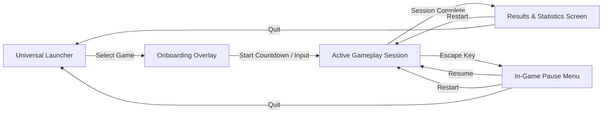

# VoltArena — Gameplay Systems & Player Experience Guide

## 1. Universal Gameplay Architecture
All seven titles in VoltArena share a unified, deterministic game loop:

---

## 2. Iron Crucible — Tactical Arena FPS

### 2.1 Game Objective & Victory Conditions
* **Objective**: First combatant to reach **20 Frags** (or highest frags when the 5-minute match clock expires) claims victory across 5 distinct game modes (Deathmatch, Team Deathmatch, Domination, Instagib, Juggernaut).
* **Match Loop**:
  1. **Spawn**: Player and 3 AI bots spawn at distinct perimeter spawn platforms in Citadel, Foundry, or Sektor.
  2. **Combat**: Engage opponents across multi-level catwalks, jump pads, and corridors.
  3. **Pickups**: Replenish Health (+25 HP up to 100), Armor (+25 Shield up to 100), and Ammo.
  4. **Death & Respawn**: Safe-transform tracking and kill-plane recovery at $Y < -6.0\text{m}$.
  5. **Victory**: Post-match results screen displaying Kills, Deaths, K/D Ratio, and Accuracy.

### 2.2 Weapon Arsenal & Handling
| Key | Weapon | Type | Damage | Clip / Res | Fire Rate | Special Behavior |
| :---: | :--- | :--- | :---: | :---: | :---: | :--- |
| `1` | **Pulse Rifle** | Rapid Hitscan | 12.0 | 30 / 120 | 0.10s | Tight spread, ideal for mid-range skirmishes |
| `2` | **Scatter Cannon** | Buckshot Spread | $8 \times 11.0$ | 8 / 32 | 0.65s | Devastating point-blank burst, high recoil |
| `3` | **Rail Driver** | Precision Hitscan | 85.0 | 4 / 16 | 1.20s | Piercing beam, $2.0\times$ critical headshot damage |
| `4` | **Grenade Launcher**| Ballistic Explosive | 95.0 | 6 / 18 | 0.80s | Arcing projectile, 5m blast radius with knockback |
| `5` | **Plasma Cutter** | Directed Energy | 18.0 | $\infty$ (Heat) | 0.08s | Continuous stream, overheats after 4.0s sustained fire |

### 2.3 Bot AI Behavior
* Autonomous bots utilize state-machine navigation:
  * **Patrol**: Roam between tactical waypoints and pickup nodes.
  * **Engage**: Face targets, strafe left/right unpredictably, and fire with realistic aim jitter.
  * **Retreat**: Seek health pickups when HP falls below 35%.
  * **Recovery**: Auto-recovers to safe ground if falling below the arena floor.

---

## 3. Metro Siege — Subway Survival FPS

### 3.1 Game Objective & Wave Escalation
* **Objective**: Survive **10 escalating waves** of subterranean mutant bio-threats, then board the 24m extraction subway train.
* **Survival Loop**:
  1. **Wave Start**: Siren sounds; mutant threat count appears on HUD (e.g. `THREATS: 10 INCOMING`).
  2. **Defense**: Defend the station platform using firearm weapons and tactical mobility.
  3. **Scrap Collection**: Defeated mutants drop glowing metallic scrap gears.
  4. **Intermission (10s)**: Access the platform ticket vending kiosk to purchase ammo refills, weapon damage upgrades, and shield capacitors.
  5. **Boss Wave (Wave 10)**: Defeat the apex BioColossus boss (1,200 HP).
  6. **Extraction**: Subway train doors open; step inside carriage to trigger evacuation victory.

### 3.2 Enemy Archetypes
* **Mutant Crawler**: Swift low-profile melee swarmer (120 HP, 8.0 m/s). Leaps at player from mid-range.
* **Mutant Stalker**: Stealth predator (180 HP, 6.5 m/s). Flanks and dodges incoming fire.
* **Acid Spitter**: Ranged bio-artillery mutant (150 HP, 5.0 m/s). Emits corrosive ballistic projectiles.
* **Armored Brute**: Heavy tank mutant (450 HP, 3.8 m/s). Absorbs heavy fire and executes ground slams.
* **BioColossus (Wave 10 Boss)**: Massive apex monstrosity (1,200 HP). Triggers arena-wide tremors and shockwaves.

---

## 4. Nitro Kick — Rocket-Car Football

### 4.1 Game Objective & Match Rules
* **Objective**: Drive high-speed rocket battle-cars and score **3 goals** in the opponent's goal net before time expires, featuring 1v1, 2v2, or 3v3 team formations with sudden-death overtime.
* **Match Mechanics**:
  * **Kickoff**: 3-second countdown with cars locked in starting positions; ball positioned at center pedestal.
  * **Ground Handling**: Responsive steering with dedicated drift multiplier ($1.75\times$) on handbrake.
  * **Nitrous Boost**: Collect 100% boost from rotating pads on pitch; activates rear thrusters for supersonic speeds ($38\text{ m/s}$).
  * **Double Jump & Air Control**: Press jump once to launch vertically; press again with pitch/yaw/roll keys to execute aerial flips and angled power shots using local transforms.
  * **Ball Physics & CCD**: Continuous collision detection with 3.0m stadium boundaries preventing clipping.

---

## 5. Drift Storm — Arcade Kart Racing

### 5.1 Game Objective & Race Structure
* **Objective**: Compete against 5 AI drivers across a 3-lap grand prix circuit and finish **1st on the podium** across 3 circuits (Alpine Ridge, Desert Mirage, Neon Speedway).
* **Race Mechanics**:
  * **Starting Gantry**: 5 red lights illuminate sequentially, then turn GREEN for race launch from a 6-slot staggered grid.
  * **Drift & Mini-Turbo**: Hold drift while cornering to charge nitrous sparks:
    * *Tier 1 (Blue Sparks)*: +15% speed burst for 0.8s.
    * *Tier 2 (Orange Sparks)*: +30% speed burst for 1.4s.
    * *Tier 3 (Purple Sparks)*: +50% speed burst for 2.2s.
  * **Sequential Checkpoints**: Anti-cheat checkpoint gates enforce full circuit adherence.
  * **Item Boxes**: Rotating mystery crates award 4 tactical powerups:
    * *Turbo Speed*: Instant forward rocket acceleration.
    * *Plasma Shield*: Deflects incoming hazard projectiles.
    * *Seeker Missile*: Locks onto and spins out the lead racer ahead.
    * *EMP Mine*: Drops a hazardous electrical trap onto the racing line behind.
  * **Off-Track Safe Recovery**: Driving off the circuit automatically resets the kart to the centerline of the last cleared checkpoint.

---

## 6. Skybound Odyssey — Open-Air 3D Platformer

### 6.1 Game Objective & Progression
* **Objective**: Journey through **5 interconnected floating regions**, solve ancient puzzle mechanisms, master advanced aerodynamic traversal, and gather the lost Sky Shards to restore the Storm Citadel.
* **Traversal Mechanics**:
  * **Ground Locomotion**: Responsive walking (7.0 m/s) and sprinting (12.5 m/s) with stamina consumption.
  * **Variable Jump & Double Jump**: Press jump to leap; tap again mid-air for double-jump propulsion.
  * **Ledge Mantle**: Automated raycast edge detection pulling the player onto climbable ledges.
  * **Glider Deployment**: Deploy the glider mid-air for sustained horizontal flight with aerodynamic glide polar curves and wind updraft lift.
  * **Grappling Hook**: Launch a high-velocity grapple cable toward grapple anchors to cross wide chasms.
* **5 Interconnected Regions**:
  1. *Emerald Isles* ($Y=0$): Lush floating starter island with ancient ruins and basic traversal challenges.
  2. *Crystal Caverns* ($Y=-25$): Subterranean glowing crystal grottos with laser switches and pressure plates.
  3. *Sunken Sky Temple* ($Y=12$): Floating temple courtyard with locked ceremonial doors.
  4. *Frost Peaks* ($Y=24$): Glaciated mountain pinnacles with updraft thermal currents.
  5. *Storm Citadel* ($Y=40$): Electrified apex fortress requiring mastery of all traversal gear.
* **Quests & Collectibles**: 5 multi-stage regional questlines managed by `QuestManager`, interactive NPC dialogs, and 25 hidden Sky Shards.

---

## 7. RoboForge Arena — Modular Physics Construction Sandbox

### 7.1 Game Objective & Workshop Loop
* **Objective**: Engineer custom combat robots in the 3D workshop, balance weight, power, and torque, and conquer **7 grueling physics obstacle courses**.
* **3D Assembly Bay**:
  * **Chassis Selection**: Scout (Light / Agile), Enforcer (Medium / Balanced), Titan (Heavy / Armored).
  * **Locomotion Systems**: High-Speed Wheels (maximum road speed), Heavy Tracks (superior hill traction), Quadruped Legs (all-terrain gap clearance).
  * **Power Matrix**: Chemical Battery (lightweight), Fission Reactor (balanced output), Fusion Matrix (massive power).
  * **Functional Tools**: Grabber Arm (object manipulation), Magnetic Emitter (scrap pull), Rocket Boosters (burst velocity), Forcefield Shield (hazard protection), Cargo Bed (transport capacity).
* **Dynamic Physics Recalculation**:
  * Every mounted module dynamically updates total mass, center of mass, motor torque, and energy drain.
* **7 Challenge Courses**:
  1. *Slalom Sprint*: High-speed obstacle cornering trial.
  2. *Heavy Haul*: Transport dense radioactive ore crates across rugged terrain.
  3. *Rock Crawl*: Extreme steep incline and boulder traversal.
  4. *Jump Crater*: High-velocity ramp launch across a seismic canyon.
  5. *Magnet Sort*: Collect and sort metallic components into target containers.
  6. *High-Speed Loop*: Overcome vertical banked wall-rides.
  7. *Boss Gauntlet*: Combine cargo carrying, jumping, and precision navigation under tight time limits.

---

## 8. WildCircuit — Wildlife Safari & Photography Traversal

### 8.1 Game Objective & Safari Experience
* **Objective**: Explore an expansive 5-biome wildlife sanctuary, track rare animal species, study their behavioral patterns, and capture award-winning photos to complete the comprehensive **Field Journal**.
* **5 Vast Biomes**:
  * *Savanna*: Open golden plains, acacia trees, and watering holes.
  * *Rainforest*: Dense tropical canopy, mossy boulders, and riverbanks.
  * *Alpine Peaks*: Craggy mountain paths and snowy summits.
  * *Coastal Dunes*: Sandy shores, tide pools, and palm clusters.
  * *Wetlands*: Mangrove swamps, reed beds, and marshlands.
* **9 Wildlife Species & 8-State Behavioral AI**:
  * Species: Gazelle, Lion, Jaguar, Macaw, Snow Leopard, Ibex, Sea Turtle, Crocodile, Flamingo.
  * AI States: Grazing, Alert, Fleeing, Hunting, Resting, Drinking, Socializing, Vocalizing.
* **Viewfinder Photography Engine**:
  * **Optical Zoom**: Smooth 24mm wide-angle to 300mm telephoto focal length zoom.
  * **Depth of Field**: Subject focus lock with cinematic background bokeh blur.
  * **Rule of Thirds Grid**: Composition framing alignment guides.
* **Deterministic Photo Scoring**:
  * Scores photos on a 1 to 5 star scale based on subject rarity, framing centering, distance, and action state bonuses (e.g., catching a Lion hunting or Macaw in flight).
* **Expedition Traversal**:
  * Traversal on foot or via the all-terrain 4x4 Explorer ATV with realistic suspension, hill climbing, and headlight illumination.

---

## 9. Complete Controls Reference

| Action | Iron Crucible / Metro Siege | Nitro Kick | Drift Storm | Skybound Odyssey | RoboForge Arena | WildCircuit |
| :--- | :--- | :--- | :--- | :--- | :--- | :--- |
| **Move / Steer** | `W`, `A`, `S`, `D` | `W`, `S` (Throttle), `A`, `D` | `W`, `S` (Throttle), `A`, `D` | `W`, `A`, `S`, `D` | `W`, `A`, `S`, `D` | `W`, `A`, `S`, `D` |
| **Look / Orbit** | Mouse Movement | Mouse Orbit | Dynamic Chase | Mouse Orbit | 360° Workshop Cam | Mouse Orbit |
| **Jump / Boost** | `Space` (Jump) | `Space` (Jump / Flip) | `Space` (Drift) | `Space` (Jump / Mantle)| `Space` (Activate Tool) | `Space` (ATV Brake / Jump)|
| **Sprint / Nitro**| `Shift` (Sprint) | `Shift` (Boost) | `Shift` (Drift) | `Shift` (Sprint / Glide)| `Shift` (Booster) | `Shift` (ATV Turbo / Sprint)|
| **Action 1** | Left Mouse (Fire) | Left Mouse (Boost) | `E` / Click (Use Item) | `E` (Interact / Action)| Left Click (Mount Part)| Left Mouse (Snap Photo) |
| **Action 2** | Right Mouse (ADS) | Right Mouse (Ball Cam)| `R` (Recovery) | Right Mouse (Grapple) | Right Click (Rotate Bay)| Right Mouse (Viewfinder Zoom)|
| **Zoom / Tool** | Mouse Wheel (Switch) | — | — | Mouse Wheel (Cam Zoom) | Mouse Wheel (Bay Zoom)| Mouse Wheel (24-300mm Zoom)|
| **Journal / Kiosk**| `E` (Kiosk / Use) | — | — | `Tab` / `Q` (Quests) | `Tab` (Challenges) | `J` (Field Journal) |
| **Reset / Recover**| `R` (Reload) | `R` (Reset Car) | `R` (Reset Kart) | Safe Ground Auto | `R` (Reset Course) | `R` (Flip ATV) |
| **Pause Menu** | `Escape` | `Escape` | `Escape` | `Escape` | `Escape` | `Escape` |
