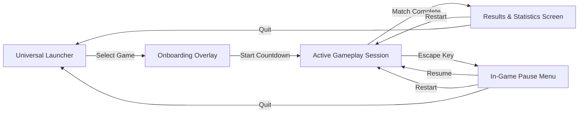

# VoltArena — Gameplay Systems & Player Experience Guide

## 1. Universal Gameplay Architecture
All four titles in VoltArena share a unified, deterministic game loop:

---

## 2. Iron Crucible — Tactical Arena FPS

### 2.1 Game Objective & Victory Conditions
* **Objective**: First combatant to reach **20 Frags** (or highest frags when the 5-minute match clock expires) claims victory.
* **Match Loop**:
  1. **Spawn**: Player and 3 AI bots spawn at distinct perimeter spawn platforms.
  2. **Combat**: Engage opponents across multi-level catwalks and corridors.
  3. **Pickups**: Replenish Health (+25 HP up to 100), Armor (+25 Shield up to 100), and Ammo.
  4. **Death & Respawn**: 2.5-second respawn delay at a safe spawn anchor.
  5. **Victory**: Post-match results screen displaying Kills, Deaths, K/D Ratio, and Accuracy.

### 2.2 Weapon Arsenal & Handling
| Key | Weapon | Type | Damage | Clip / Res | Fire Rate | Special Behavior |
| :---: | :--- | :--- | :---: | :---: | :---: | :--- |
| `1` | **Pulse Rifle** | Rapid Hitscan | 12.0 | 30 / 120 | 0.10s | Tight spread, ideal for mid-range skirmishes |
| `2` | **Scatter Cannon** | Buckshot Spread | $8 \times 11.0$ | 8 / 32 | 0.65s | Devastating point-blank burst, high recoil |
| `3` | **Rail Driver** | Precision Hitscan | 85.0 | 4 / 16 | 1.20s | Piercing beam, $2.0\times$ critical headshot damage |
| `4` | **Grenade Launcher**| Ballistic Explosive | 95.0 | 6 / 18 | 0.80s | Arcing projectile, 5m blast radius with knockback |
| `5` | **Plasma Cutter** | Directed Energy | 18.0 | $\infty$ (Heat) | 0.08s | Continuous stream, overheats after 4.0s sustained fire |

### 2.3 Bot AI Behavior
* Autonomous bots utilize state-machine navigation:
  * **Patrol**: Roam between tactical waypoints and pickup nodes.
  * **Search**: Move toward weapon fire audio events.
  * **Engage**: Face targets, strafe left/right unpredictably, and fire with realistic aim jitter.
  * **Retreat**: Seek health pickups when HP falls below 35%.

---

## 3. Metro Siege — Subway Survival FPS

### 3.1 Game Objective & Wave Escalation
* **Objective**: Survive **10 escalating waves** of subterranean mutant bio-threats, then board the 24m extraction subway train.
* **Survival Loop**:
  1. **Wave Start**: Siren sounds; mutant threat count appears on HUD (e.g. `THREATS: 10 INCOMING`).
  2. **Defense**: Defend the station platform using firearm weapons and tactical mobility.
  3. **Scrap Collection**: Defeated mutants drop glowing metallic scrap gears.
  4. **Intermission (10s)**: Access the platform ticket vending kiosk to purchase ammo refills, weapon damage upgrades, and shield capacitors.
  5. **Boss Wave (Wave 10)**: Defeat the apex BioColossus boss.
  6. **Extraction**: Subway train doors open; step inside carriage to trigger evacuation victory.

### 3.2 Enemy Archetypes
* **Mutant Crawler**: Swift low-profile melee swarmer (120 HP, 8.0 m/s). Leaps at player from mid-range.
* **Acid Spitter**: Ranged bio-artillery mutant (150 HP, 5.0 m/s). Emits corrosive ballistic projectiles.
* **Armored Brute**: Heavy tank mutant (450 HP, 3.8 m/s). Absorbs heavy fire and executes ground slams.
* **BioColossus (Wave 10 Boss)**: Massive apex monstrosity (2,500 HP). Triggers arena-wide tremors.

---

## 4. Nitro Kick — Rocket-Car Football

### 4.1 Game Objective & Match Rules
* **Objective**: Drive high-speed rocket battle-cars and score **3 goals** in the opponent's goal net before time expires.
* **Match Mechanics**:
  * **Kickoff**: 3-second countdown with cars locked in starting positions; ball positioned at center pedestal.
  * **Ball Physics**: Truncated icosahedron ball responds to velocity, car surface angles, and aerial impacts.
  * **Nitrous Boost**: Collect 100% boost from rotating pads on pitch; activates rear thrusters for supersonic speeds ($38\text{ m/s}$).
  * **Double Jump**: Press jump once to clear low obstacles; press again with pitch/roll keys to execute aerial flips and aerial shots.
  * **Continuous Collision Protection**: Ball and car boundaries utilize continuous collision detection (CCD) with 3.0m colliders to prevent clipping through the pitch perimeter.

---

## 5. Drift Storm — Arcade Kart Racing

### 5.1 Game Objective & Race Structure
* **Objective**: Compete against 5 AI drivers across a 3-lap grand prix circuit and finish **1st on the podium**.
* **Race Mechanics**:
  * **Starting Gantry**: 5 red lights illuminate sequentially, then turn GREEN for race launch.
  * **Drift & Mini-Turbo**: Hold drift while cornering to charge nitrous sparks:
    * *Tier 1 (Blue Sparks)*: +15% speed burst for 0.8s.
    * *Tier 2 (Orange Sparks)*: +30% speed burst for 1.4s.
    * *Tier 3 (Purple Sparks)*: +50% speed burst for 2.2s.
  * **Sequential Checkpoints**: Anti-cheat checkpoint gates enforce full circuit adherence.
  * **Item Boxes**: Rotating mystery crates award 4 tactical powerups:
    * *Turbo Mushroom*: Instant forward rocket acceleration.
    * *Plasma Shield*: Deflects incoming hazard projectiles.
    * *Seeker Missile*: Locks onto and spins out the lead racer ahead.
    * *EMP Mine*: Drops a hazardous electrical trap onto the racing line behind.
  * **Off-Track Safe Recovery**: Driving off the circuit automatically resets the kart to the centerline of the last cleared checkpoint with momentary invulnerability.

---

## 6. Controls Reference

| Action | Iron Crucible / Metro Siege | Nitro Kick | Drift Storm |
| :--- | :--- | :--- | :--- |
| **Steer / Move** | `W`, `A`, `S`, `D` | `W`, `S` (Throttle), `A`, `D` (Steer) | `W`, `S` (Throttle), `A`, `D` (Steer) |
| **Look / Aim** | Mouse Movement | Mouse Orbit (Free Cam) | Dynamic Auto-Chase |
| **Primary Action**| Left Mouse (Fire Weapon) | `Shift` (Nitrous Boost) | `Shift` / `Space` (Drift) |
| **Secondary Action**| Right Mouse (ADS Zoom) | `Space` (Jump / Aerial Flip) | `E` / Left Click (Use Item) |
| **Reload / Reset** | `R` (Reload Magazine) | `R` (Reset Car to Center) | `R` (Manual Track Recovery) |
| **Weapon Select** | `1`, `2`, `3`, `4`, `5` | — | — |
| **Pause Menu** | `Escape` | `Escape` | `Escape` |
