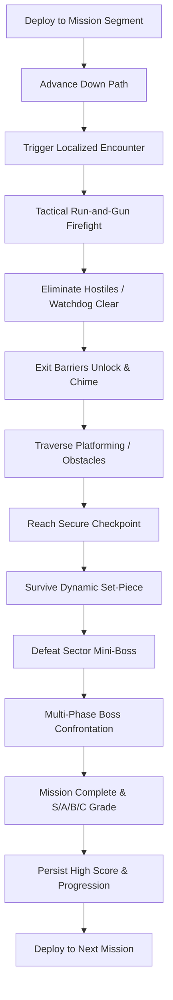

# Strike Vector — Game Design Document

## 1. Executive Summary
* **Title**: STRIKE VECTOR
* **Genre**: Modern 3D Forward-Moving Run-and-Gun Shooter
* **Platform**: Godot 4.3 Stable (GL Compatibility renderer, Web / Desktop / Mobile)
* **Design Philosophy**: Progression philosophy of classic arcade shooters: continuous forward advance through changing scenes, fighting location-specific enemies, overcoming obstacles, completing tactical objectives, reaching checkpoints, defeating mini-bosses, surviving set-pieces, conquering multi-phase bosses, and extracting safely.

---

## 2. Core Game Loop

---

## 3. Campaign Missions (8 Distinct Theaters)
1. **Mission 1: Urban Blackout**
   - *Flow*: Streets $\rightarrow$ Commercial Alleys $\rightarrow$ Mall Interior $\rightarrow$ Parking Structure $\rightarrow$ Rooftops $\rightarrow$ Evacuation Plaza.
   - *Mini-Boss*: Heavy Patrol Mech.
   - *Boss*: Assault VTOL Gunship with dual rocket pods.
2. **Mission 2: High-Speed Rail**
   - *Flow*: Terminal Concourse $\rightarrow$ High-Speed Passenger Cars $\rightarrow$ Moving Train Roof $\rightarrow$ Cargo Flats $\rightarrow$ Suspension Rail Bridge.
   - *Mini-Boss*: Armored Interceptor Drone.
   - *Boss*: Heavily Gunned Rail Cruiser Craft.
3. **Mission 3: Harbor Assault**
   - *Flow*: Container Terminals $\rightarrow$ Marine Warehouses $\rightarrow$ Gantry Crane Yard $\rightarrow$ Drydock Basin $\rightarrow$ Cargo Carrier Vessel.
   - *Mini-Boss*: Hydraulic Cargo Loader Mech.
   - *Boss*: Harbor Defense Cruiser Fortress.
4. **Mission 4: Desert Convoy**
   - *Flow*: Outpost Settlement $\rightarrow$ Canyon Pass $\rightarrow$ Armored Moving Convoy $\rightarrow$ Cracking Refinery $\rightarrow$ Pipeline Terminus.
   - *Mini-Boss*: Convoy Heavy Battle Tank.
   - *Boss*: Armored Land Crawler Locomotive.
5. **Mission 5: Arctic Installation**
   - *Flow*: Snowfield Outskirts $\rightarrow$ Fortress Perimeter $\rightarrow$ Sub-Zero Labs $\rightarrow$ Glacial Ice Cavern $\rightarrow$ Radar Missile Launchpad.
   - *Mini-Boss*: Cryo Autonomous Walker.
   - *Boss*: Sub-Zero Fortress Core Mech.
6. **Mission 6: Megafactory**
   - *Flow*: Logistic Freight Bays $\rightarrow$ Automated Assembly Line $\rightarrow$ Robotic Sorting Floor $\rightarrow$ Industrial Foundry Furnace $\rightarrow$ Cyber Control Center.
   - *Mini-Boss*: Industrial Overhead Crane Sentinel.
   - *Boss*: Automated Factory Core Unit.
7. **Mission 7: Sky Fortress**
   - *Flow*: Combat Drop Insertion $\rightarrow$ Exterior Catwalks $\rightarrow$ Fighter Hangar $\rightarrow$ High-Voltage Corridors $\rightarrow$ Plasma Reactor Deck $\rightarrow$ Command Deck.
   - *Mini-Boss*: Stealth Pursuit Drone.
   - *Boss*: Sky Fortress Airborne Command Citadel.
8. **Mission 8: Final Citadel**
   - *Flow*: Trench Breach $\rightarrow$ Bastion Vehicle Bay $\rightarrow$ Fortress Interior $\rightarrow$ Grand Spire Spindle $\rightarrow$ Multi-Phase Overlord Titan $\rightarrow$ Timed Aerial Extraction.
   - *Mini-Boss*: Praetorian Elite Commander.
   - *Boss*: Overlord Titan Mech (Multi-Phase: Kinetic Armor $\rightarrow$ Exposed Energy Core $\rightarrow$ Overdrive Meltdown).

---

## 4. Player Mechanics & Camera Systems
- **Locomotion**: CharacterBody3D with 0.15s coyote & jump buffering, sprint, crouch, slide-fire, dodge-roll, ledge mantling, anti-fall recovery plane.
- **Health & Armor**: 100 HP, 100 Shield Armor. Armor absorbs 60% of incoming damage before health depletion.
- **Camera Director**: SpringArm3D with raycast occlusion testing and 7 interpolation camera modes:
  1. `THIRD_PERSON_COMBAT` (Standard over-the-shoulder)
  2. `ADS_SHOULDER` (Tight zoom FOV 55)
  3. `SIDE_SCROLLER_25D` (Arcade run-and-gun lateral perspective)
  4. `FORWARD_CORRIDOR` (Direct forward-tracking corridor view)
  5. `VEHICLE_CHASE` (High-speed cinematic vehicle tracking)
  6. `BOSS_ARENA` (Elevated panoramic arena framing)
  7. `CINEMATIC_TRANSITION` (Scripted smooth transition framing)

---

## 5. Arsenal & Equipment
- **Weapons (9 Original Types)**:
  - `VX-7 Assault Rifle` (Automatic 30-round mag, balanced)
  - `Tempest SMG` (High RPM, 35-round mag, high agility)
  - `Breach Shotgun` (8 pellets, heavy spread close-quarters)
  - `Atlas Battle Rifle` (3-round burst, 24 rounds, marksman)
  - `Longshot Marksman` (High damage precision sniper, 8 rounds)
  - `Cyclone LMG` (100 rounds sustained fire, heavy suppression)
  - `Arc Launcher` (Explosive plasma orb, 6 rounds, AoE)
  - `Pulse Cannon` (Penetrating charged laser, 12 rounds)
  - `Tactical Sidearm` (Rapid backup pistol, 15 rounds, $\infty$ reserve)
- **Power Modules**: Rapid Fire, Spread Module, Piercing Module, Shield Overcharge, Overdrive, Support Drone.

---

## 6. AI Architecture
- **HFSM**: 10 distinct states (`IDLE`, `PATROL`, `SUSPICIOUS`, `INVESTIGATE`, `ALERT`, `COVER_FLANK`, `AIM`, `ATTACK`, `REPOSITION`, `SEARCH`).
- **Squad Coordinator**: Distributed attack token pool ($N=3$) and lateral flanking slot assignments to prevent chaotic dogpiles.
- **Perception**: Dynamic Field of View ($110^\circ$), raycast LOS, acoustic hearing events.
- **Deterministic Watchdog**: 28-second watchdog timer prevents progression deadlocks caused by lost or geometry-stuck enemies.
- **Navigation Mesh**: Programmatic `NavigationRegion3D` generation provides walkable navigation polygons across roadway and pedestrian corridors for authentic pathfinding.

---

## 7. Tactical Navigation & HUD Architecture
- **Top-Center Compass Tape**: Real-time degree heading with cardinal markers ($N, NE, E, SE, S, SW, W, NW$) and dynamic objective diamond bearing with range readout (`[◆ JAMMER 128m]`).
- **Top-Right Radar Minimap**: Circular planar radar tracking player position and forward orientation, road corridor boundaries, objective beacons, and threat-aware hostile blips with a 3.0-second fade timer.
- **Full Tactical Map (M Key)**: Modal schematic providing bird's-eye view of corridor milestones, active checkpoints, and extraction zones.
- **Combat Crosshair Convergence**: Camera center raycast calculates 3D point-of-aim at reticle hit, dynamically rotating projectile trajectory from weapon muzzle to impact point, eliminating low-cover clipping.

---

## 8. World Scale & Environmental Storytelling
- **Human Scale**: Structures scaled to authentic proportions ($14\text{m}$ to $24\text{m}$ tall, $8\text{m}$ roadway, $3\text{m}$ sidewalks) creating dense urban canyons.
- **Blackout Atmosphere**: Emergency hazard beacons, generator hum, disabled neon signs, burning wreckage, police roadblocks, and volumetric fog conveying blackout crisis.
