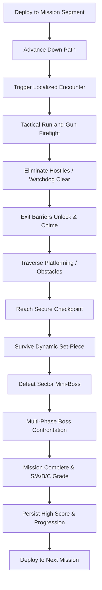

# Strike Vector — Game Design Document

## 1. Executive Summary
* **Title**: STRIKE VECTOR
* **Genre**: Modern 3D Forward-Moving Run-and-Gun Shooter
* **Platform**: Godot 4.3 Stable (GL Compatibility renderer, Web / Desktop / Mobile)
* **Design Philosophy**: Progression philosophy of classic arcade shooters: continuous forward advance through changing scenes, fighting location-specific enemies, overcoming obstacles, completing tactical objectives, reaching checkpoints, defeating mini-bosses, surviving set-pieces, conquering multi-phase bosses, and extracting safely.

---

## 2. Core Game Loop


---

## 3. Campaign Missions (8 Distinct Theaters)
1. **Mission 1: Urban Blackout**
   - *Flow*: Streets $\rightarrow$ Commercial Alleys $\rightarrow$ Mall Interior $\rightarrow$ Parking Structure $\rightarrow$ Rooftops $\rightarrow$ Evacuation Plaza.
   - *Mini-Boss*: Heavy Patrol Mech.
   - *Boss*: Assault VTOL Gunship with dual rocket pods.
2. **Mission 2: High-Speed Rail**
   - *Flow*: Terminal Concourse $\rightarrow$ High-Speed Passenger Cars $\rightarrow$ Moving Train Roof $\rightarrow$ Cargo Flats $\rightarrow$ Suspension Rail Bridge.
   - *Mini-Boss*: Armored Interceptor Drone.
   - *Boss*: Heavily Gunned Rail Cruiser Craft.
3. **Mission 3: Harbor Assault**
   - *Flow*: Container Terminals $\rightarrow$ Marine Warehouses $\rightarrow$ Gantry Crane Yard $\rightarrow$ Drydock Basin $\rightarrow$ Cargo Carrier Vessel.
   - *Mini-Boss*: Hydraulic Cargo Loader Mech.
   - *Boss*: Harbor Defense Cruiser Fortress.
4. **Mission 4: Desert Convoy**
   - *Flow*: Outpost Settlement $\rightarrow$ Canyon Pass $\rightarrow$ Armored Moving Convoy $\rightarrow$ Cracking Refinery $\rightarrow$ Pipeline Terminus.
   - *Mini-Boss*: Convoy Heavy Battle Tank.
   - *Boss*: Armored Land Crawler Locomotive.
5. **Mission 5: Arctic Installation**
   - *Flow*: Snowfield Outskirts $\rightarrow$ Fortress Perimeter $\rightarrow$ Sub-Zero Labs $\rightarrow$ Glacial Ice Cavern $\rightarrow$ Radar Missile Launchpad.
   - *Mini-Boss*: Cryo Autonomous Walker.
   - *Boss*: Sub-Zero Fortress Core Mech.
6. **Mission 6: Megafactory**
   - *Flow*: Logistic Freight Bays $\rightarrow$ Automated Assembly Line $\rightarrow$ Robotic Sorting Floor $\rightarrow$ Industrial Foundry Furnace $\rightarrow$ Cyber Control Center.
   - *Mini-Boss*: Industrial Overhead Crane Sentinel.
   - *Boss*: Automated Factory Core Unit.
7. **Mission 7: Sky Fortress**
   - *Flow*: Combat Drop Insertion $\rightarrow$ Exterior Catwalks $\rightarrow$ Fighter Hangar $\rightarrow$ High-Voltage Corridors $\rightarrow$ Plasma Reactor Deck $\rightarrow$ Command Deck.
   - *Mini-Boss*: Stealth Pursuit Drone.
   - *Boss*: Sky Fortress Airborne Command Citadel.
8. **Mission 8: Final Citadel**
   - *Flow*: Trench Breach $\rightarrow$ Bastion Vehicle Bay $\rightarrow$ Fortress Interior $\rightarrow$ Grand Spire Spindle $\rightarrow$ Multi-Phase Overlord Titan $\rightarrow$ Timed Aerial Extraction.
   - *Mini-Boss*: Praetorian Elite Commander.
   - *Boss*: Overlord Titan Mech (Multi-Phase: Kinetic Armor $\rightarrow$ Exposed Energy Core $\rightarrow$ Overdrive Meltdown).

---

## 4. Player Mechanics & Camera Systems
- **Locomotion**: CharacterBody3D with 0.15s coyote & jump buffering, sprint, crouch, slide-fire, dodge-roll, ledge mantling, anti-fall recovery plane.
- **Health & Armor**: 100 HP, 100 Shield Armor. Armor absorbs 60% of incoming damage before health depletion.
- **Camera Director**: SpringArm3D with raycast occlusion testing and 7 interpolation camera modes:
  1. `THIRD_PERSON_COMBAT` (Standard over-the-shoulder)
  2. `ADS_SHOULDER` (Tight zoom FOV 55)
  3. `SIDE_SCROLLER_25D` (Arcade run-and-gun lateral perspective)
  4. `FORWARD_CORRIDOR` (Direct forward-tracking corridor view)
  5. `VEHICLE_CHASE` (High-speed cinematic vehicle tracking)
  6. `BOSS_ARENA` (Elevated panoramic arena framing)
  7. `CINEMATIC_TRANSITION` (Scripted smooth transition framing)

---

## 5. Arsenal & Equipment
- **Weapons (9 Original Types)**:
  - `VX-7 Assault Rifle` (Automatic 30-round mag, balanced)
  - `Tempest SMG` (High RPM, 35-round mag, high agility)
  - `Breach Shotgun` (8 pellets, heavy spread close-quarters)
  - `Atlas Battle Rifle` (3-round burst, 24 rounds, marksman)
  - `Longshot Marksman` (High damage precision sniper, 8 rounds)
  - `Cyclone LMG` (100 rounds sustained fire, heavy suppression)
  - `Arc Launcher` (Explosive plasma orb, 6 rounds, AoE)
  - `Pulse Cannon` (Penetrating charged laser, 12 rounds)
  - `Tactical Sidearm` (Rapid backup pistol, 15 rounds, $\infty$ reserve)
- **Power Modules**: Rapid Fire, Spread Module, Piercing Module, Shield Overcharge, Overdrive, Support Drone.

---

## 6. AI Architecture
- **HFSM**: 10 distinct states (`IDLE`, `PATROL`, `SUSPICIOUS`, `INVESTIGATE`, `ALERT`, `COVER_FLANK`, `AIM`, `ATTACK`, `REPOSITION`, `SEARCH`).
- **Squad Coordinator**: Distributed attack token pool ($N=3$) and lateral flanking slot assignments to prevent chaotic dogpiles.
- **Perception**: Dynamic Field of View ($110^\circ$), raycast LOS, acoustic hearing events.
- **Deterministic Watchdog**: 28-second watchdog timer prevents progression deadlocks caused by lost or geometry-stuck enemies.
- **Navigation Mesh**: Programmatic `NavigationRegion3D` generation provides walkable navigation polygons across roadway and pedestrian corridors for authentic pathfinding.

---

## 7. Tactical Navigation & HUD Architecture
- **Top-Center Compass Tape**: Real-time degree heading with cardinal markers ($N, NE, E, SE, S, SW, W, NW$) and dynamic objective diamond bearing with range readout (`[◆ JAMMER 128m]`).
- **Top-Right Radar Minimap**: Circular planar radar tracking player position and forward orientation, road corridor boundaries, objective beacons, and threat-aware hostile blips with a 3.0-second fade timer.
- **Full Tactical Map (M Key)**: Modal schematic providing bird's-eye view of corridor milestones, active checkpoints, and extraction zones.
- **Combat Crosshair Convergence**: Camera center raycast calculates 3D point-of-aim at reticle hit, dynamically rotating projectile trajectory from weapon muzzle to impact point, eliminating low-cover clipping.
- **Directional Threat Indicators**: `StrikeDirectionalDamageIndicator` calculates the screen-space angular bearing of attackers, rendering glowing threat arcs around the reticle and pulsing a red peripheral vignette on damage.

---

## 8. World Scale & Environmental Storytelling
- **Metric Scale Standard**: 1 Godot unit = 1 metre convention enforced throughout all assets.
  - Human Operative: $1.80\text{m}$ height, $0.40\text{m}$ radius capsule.
  - Vehicles: Authentic proportions: Enforcer patrol cruiser $4.56\text{m} \times 2.08\text{m} \times 2.0\text{m}$; Heavy utility truck $6.16\text{m} \times 3.3\text{m} \times 3.19\text{m}$.
  - Street Hierarchy: $14.0\text{m}$ wide two-lane asphalt roadway with $3.5\text{m}$ sidewalks ($21.0\text{m}$ total canyon width), enclosed by $14\text{m}\text{--}24\text{m}$ multi-story buildings.
- **Blackout Atmosphere**:
  - Deep midnight sky lighting (energy $0.35$, directional moonlight $0.85$) with atmospheric distance fog (density $0.0035$).
  - Dark grimy concrete facades and weathered carbon steel replacing bright pastel townhouses.
  - Blinking orange/red hazard beacons on roadblocks and disabled emergency vehicle lightbars.
  - Disabled commercial neon signage, burning debris, and selective emergency lighting.

---

## 9. Drift Storm — Arcade Kart Racing (Title 4)

### 9.1 Title Overview & Core Gameplay Loop
* **Title**: DRIFT STORM
* **Genre**: High-Octane Arcade Kart Racing
* **Platform**: Godot 4.3 Stable (GL Compatibility, Desktop & Web)
* **Core Loop**:
  ```mermaid
  graph TD
      Select[Select Vehicle & Circuit] --> Grid[Grid Spawn & Starting Light Gantry]
      Grid --> Countdown[3-2-1-GO Simultaneous Release]
      Countdown --> Race[3-Lap Multi-Tier Competition]
      Race --> Drift[Powerslide & Mini-Turbo Generation]
      Drift --> Overtake[Slipstream & Overtake Competitors]
      Overtake --> Gates[Continuous Checkpoint Progression]
      Gates --> Lap[Complete 3 Laps]
      Lap --> Finish[Checkered Flag & Final Results]
      Finish --> Podium[Podium Ceremony & Leaderboard Save]
  ```

### 9.2 Authoritative RaceSpline & Track Hierarchy
All race mechanics derive strictly from a single authoritative `RaceSpline` model:
- Dense arc-length sample cache ($0.5\text{m}$ resolution) providing centerline position $\vec{P}(s)$, forward tangent $\vec{T}(s)$, surface normal $\vec{N}(s)$, lateral binormal $\vec{B}(s)$, and drivable width bounds.
- Watertight collision generated via continuous road foundations with zero internal seams or collision steps.

### 9.3 Six Global Production Circuits
1. **Volt Speedway**: Professional Grand Prix stadium raceway ($755\text{m}$, 504 samples), high-speed pit straight, start/finish gantry, spectator grandstands, Armco barriers, asphalt ribbon with blue/white kerb strips, chicane and banked hairpin.
2. **Sunset Coast**: Scenic coastal highway circuit ($830\text{m}$), palm trees, ocean view vistas, beach sand runoffs, and sweeping high-speed bends.
3. **Canyon Run**: Rugged mountain desert circuit ($848\text{m}$, 566 samples), red-rock sandstone formations, mountain tunnels, elevation changes, wooden crash rails, and gravel runoff.
4. **Skyline Drift**: High-tech metropolis night circuit ($812\text{m}$, 542 samples), elevated highway overpasses, neon-lit skyscrapers, tight $90^\circ$ and $180^\circ$ drift bends, concrete barriers, and street lighting.
5. **Alpine Rush**: High-altitude alpine mountain pass ($865\text{m}$), steep switchbacks, pine tree forests, sheer cliff faces, and snow-dusted runoffs.
6. **Storm Harbor**: Industrial seaport shipping facility ($820\text{m}$), shipping container canyons, giant gantry harbor cranes, wet asphalt reflections, and narrow chicanes.

### 9.4 Five Vehicle Archetypes & 4-Wheel Physics
- **5 Archetypes**:
  - *Speeder* (CIK-FIA Kart): Mass $680\text{ kg}$, top speed $32\text{ m/s}$, accel $28\text{ m/s}^2$, ultra-agile handling.
  - *Phantom* (GT Coupe): Mass $750\text{ kg}$, top speed $35\text{ m/s}$, accel $24\text{ m/s}^2$, straight-line draft specialist.
  - *Enforcer* (Offroad Buggy): Mass $920\text{ kg}$, top speed $29\text{ m/s}$, accel $32\text{ m/s}^2$, rough terrain stability.
  - *Turbo Demon* (Cyber EV): Mass $710\text{ kg}$, top speed $34\text{ m/s}$, accel $30\text{ m/s}^2$, rapid drift charge rate.
  - *Formula* (Open-Wheel F1): Mass $620\text{ kg}$, top speed $38\text{ m/s}$, accel $32\text{ m/s}^2$, high aerodynamic downforce.
- **Physics Suspension**: 4 physical raycasts at wheel contact patches with spring-damper compression ($0.28\text{m}$ rest, $0.12\text{m}$ travel), rolling wheel animation ($\omega = v/r$), front wheel steering yaw ($\pm 28^\circ$), and zero hover ($y = 0.08\text{m}$ chassis rest).
- **Corridor Clearance**: Automated verification (`verify_race_corridor_clearance`) ensuring 0 trackside prop intrusions across all 6 circuits.

### 9.5 Championship Pre-Race Hub & 11-Stage Scene State Machine
- **11-Stage Scene State Machine**:
  - Pre-Race Menu States: `DriftHome` $\rightarrow$ `ModeSelect` $\rightarrow$ `TrackSelect` $\rightarrow$ `VehicleSelect` $\rightarrow$ `RaceSetup` $\rightarrow$ `Confirm`.
  - Active Race States: `Loading` $\rightarrow$ `Grid` $\rightarrow$ `Countdown` $\rightarrow$ `Racing` $\rightarrow$ `Finished`.
- **Strict Visual & Processing Isolation**:
  - In all pre-race menu states, `_set_race_world_active(false)` disables and hides the procedural track generator, player kart, and AI opponent karts (`process_mode = PROCESS_MODE_DISABLED`, `visible = false`).
  - In-race HUD is completely hidden during pre-race configuration.
  - The 3D race world, starting grid positions, camera directors, and race HUD activate **ONLY** upon explicit countdown launch via `start_race()`.
- **Championship Pre-Race Hub UI**:
  - Interactive Track Browser featuring cards for all 6 circuits with length, laps, difficulty, surface, weather/atmosphere, records, and rewards.
  - Vector Track Spline Preview Canvas: Dynamically samples circuit splines and renders high-definition 2D preview paths in the UI.
  - Vehicle Garage: 5 vehicle archetypes with real-time performance radar bars (Top Speed, Acceleration, Handling Grip, Drift Charge, Turbo Boost).
  - Mode Selector: Championship Grand Prix, Single Race, Time Attack.
- **Responsive Viewport Adaptation**:
  - Responsive full-screen UI layout guaranteeing zero clipping on displays $\le 800\text{px}$ height.
  - Always-visible bottom navigation bar with $\ge 48\text{dp}$ touch targets: `[⮌ RETURN TO LAUNCHER]`, `[◀ PREVIOUS]`, `[CONTINUE ▶]`, and `[▶▶ CONFIRM & START RACE ◀◀]`.
  - Seamlessly scales across all 9 canonical viewports from mobile portrait ($360\times 800$) to desktop QHD ($2560\times 1440$).

### 9.6 Authoritative Wrong-Way System
- Continuous planar projection of forward vector $\vec{F}$ against spline tangent $\vec{T}$.
- Triggers **ONLY** when: $\vec{F} \cdot \vec{T} < -0.30$, forward speed $>3.0\text{ m/s}$, vehicle is within track corridor, and condition persists $>0.6\text{s}$.
- Rapid decay hysteresis and immediate auto-clearance upon facing forward. Zero false warnings on valid clockwise laps.

### 9.7 AI Competitors & HUD
- **AI Navigation**: Curvature-aware lookahead steering ($10\text{--}26\text{m}$), trail-braking, lateral lane separation, slipstream draft overtaking, and stuck watchdog unjamming.
- **Dynamic Minimap Canvas**: 64-sample vector track ribbon with player chevron, finish line, and real-time color-coded opponent markers derived directly from `RaceSpline`.
- **Race Position**: Continuous distance-based progress sorting: $\text{prog} = (\text{lap}-1) \cdot L + s$.

---

## 10. Nitro Kick — Rocket-Car Arena Football (Title 3)

### 10.1 Title Overview & Core Gameplay Loop
* **Title**: NITRO KICK
* **Genre**: High-Speed Rocket-Car Sports Arena
* **Platform**: Godot 4.3 Stable (GL Compatibility, Desktop & Web)
* **Core Loop**:
  ```mermaid
  graph TD
      Kickoff[Kickoff Spawn & Countdown] --> Sprint[Sprint to Center Ball]
      Sprint --> Contest[First Touch & High-Velocity Aerial Strike]
      Contest --> Possession[Team Possession & Tactical Wall Drives]
      Possession --> Shot[Lead Shot Toward Goal Cage]
      Shot --> Save{Goalkeeper Save?}
      Save -- Yes --> Rebound[Rebound Clear & Counter Attack]
      Rebound --> Possession
      Save -- No --> Goal[GOAL! Explosion, Siren & Crowd Roar]
      Goal --> Reset[Scoreboard Increment & Kickoff Reset]
      Reset --> Overtime{Match Clock 0:00 & Tied?}
      Overtime -- Yes --> SuddenDeath[Sudden Death Golden Goal]
      Overtime -- No --> Final[Final Whistle & Match Celebration]
  ```

### 10.2 Vehicle Dynamics & Canonical Coordinates
- **Coordinate Hierarchy**: Canonical $-Z$ forward, $+Z$ rear, $+Y$ up across all vehicle nodes. Imported GLTF visual meshes normalized under `VisualRoot` (`rotation_degrees.y = 180.0`).
- **Aerodynamics & Thrusters**: Headlights at $Z = -1.82$ facing $-Z$, rear taillights at $Z = 1.76$, dual rocket thrusters at $Z = 1.88$ facing $+Z$, and front bumper Area3D at $Z = -1.90$ facing $-Z$. Dynamic front-wheel steering yaw ($\pm 28^\circ$) and active boost flame scaling.
- **4 Authentic Vehicle Archetypes**:
  - *Apex Spectre* (Sports Coupe): Mass $1050\text{ kg}$, accel $36\text{ m/s}^2$, boost top speed $52\text{ m/s}$, agile turning.
  - *Dune Raider* (Rally Buggy): Mass $1150\text{ kg}$, accel $32\text{ m/s}^2$, high suspension travel, drift stability.
  - *Titan Enforcer* (Muscle GT): Mass $1400\text{ kg}$, accel $28\text{ m/s}^2$, heavy ball hit impulse.
  - *Volt Pulse* (Futuristic EV): Mass $1100\text{ kg}$, accel $34\text{ m/s}^2$, instant torque, hyper-responsive aerial pitch/yaw.
- **Aerial Maneuvers**: Double jump with vertical thruster burst (`can_double_jump`), in-air pitch, yaw, and roll orientation controls, and self-righting roll recovery upon ground contact.

### 10.3 Soccer Ball Physics & Anti-Tunneling
- **Physical Bouncy Ball (`Ball`)**: Continuous collision detection (`continuous_cd = true`) and contact monitor with 4 reported contacts.
- **Single-Impulse Integration**: Re-engineered `apply_ball_impulse()` strictly calling `apply_central_impulse()`, eliminating double-velocity integration.
- **Reset API**: Exposes `reset_ball()` forwarding to `reset_to_center()` at $(0, 1.2, 0)$ for deterministic kickoff resets.

### 10.4 Regulation Stadium Colosseum
- **Stadium Dimensions**: Regulation $110\text{m} \times 64\text{m} \times 20\text{m}$ with $45^\circ$ octagonal containment corners and continuous curved boundary walls.
- **Kickboards & Upper Glass**: $2.5\text{m}$ lower kickboards with scrolling LED ribbons, transparent acrylic upper containment panels, and overhead floodlight gantries.
- **Regulation Goal Cages**: $16\text{m} \times 6.5\text{m} \times 6.0\text{m}$ visible 3D goal cages with white tubular posts and net mesh.
- **Goal Attribution**: Entering North goal scores for Blue (`scoring_team = 0`), entering South goal scores for Orange (`scoring_team = 1`).
- **Boost Infrastructure**: 28 turf boost pads (+12 boost) and 6 full-boost perimeter orbs (+100 boost) with dynamic respawn timers.
- **Dynamic MultiMesh Crowd**: Animated crowd instances reacting dynamically to match events (`idle`, `goal`, `celebration`).

### 10.5 Tactical AI & Team Formations
- **Team Formations**: 1v1, 2v2, and 3v3 match modes with dynamic role allocation:
  - `STRIKER`: Aggressive ball-hunting, aerial header jumps, shooting lines on opposing goal.
  - `SUPPORT`: Midfield coverage, collecting boost pads, anticipating rebounds.
  - `DEFENDER`: Sweeping the defensive half, clearing contested balls to the corners.
  - `GOALKEEPER`: Positioning between ball and goal net, diving saves on high-speed shots.
- **Predictive Lead Intercept**: Iterative time-of-flight convergence calculating exact intercept point ahead of the moving ball trajectory.
- **Aerial Header Headers**: Automated vertical jump and pitch strikes when ball altitude is within $[2.5\text{m}, 6.0\text{m}]$.

---

## 11. Cross-Platform Architectural Framework

### 11.1 Universal Platform Capabilities (`PlatformCapabilities`)
- **OS & Environment Discovery**: Automatically categorizes platform into Web (WASM/WebGL2), Windows x86_64, Android ARM64, Linux, macOS, and iOS.
- **Safe-Area Insets**: Queries `DisplayServer.get_display_safe_area()` and computes left, top, right, and bottom insets to ensure critical controls are never obstructed by camera cutouts, notches, or system gesture pills.
- **Aspect Ratio Categorization**: Formats viewports into canonical ratios: 16:9 (Standard), 16:10 (Laptops/Tablets), 18:9, 19.5:9 (Modern iPhone), 20:9 (Modern Android), 4:3 (iPad), and 21:9 (Ultrawide).
- **Device Performance Tiers**: Dynamically assigns hardware performance tiers (`TIER_LOW`, `TIER_MEDIUM`, `TIER_HIGH`, `TIER_ULTRA`) based on detected core counts, video memory limits, and platform constraints.
- **Touch Target Standard**: Enforces a strict minimum touch target dimension of $48\text{dp}$ ($\approx 48\text{px}$ base scale) across all interactive touch elements.

### 11.2 Semantic Input Profiles (`InputProfile`)
- **Profile Categories**: `DESKTOP_KEYBOARD_MOUSE`, `DESKTOP_CONTROLLER`, `TOUCH_PHONE`, `TOUCH_TABLET`.
- **Genre Support**: `GENRE_FPS`, `GENRE_RACING`, `GENRE_ROCKET_CAR`, `GENRE_PLATFORMER`, `GENRE_GENERIC`.
- **Dynamic Action Prompts**: Resolves semantic action names into contextual user-facing button glyphs or text (e.g. "Space / RT / [BOOST]", "W / Left Stick / [THROTTLE]", "Shift / X / [DRIFT]").

### 11.3 Scalable Graphics Profiles (`GraphicsProfile`)
- **Presets**: `PRESET_LOW`, `PRESET_MEDIUM`, `PRESET_HIGH`, `PRESET_ULTRA`, `PRESET_AUTO`.
- **Dynamic Scalers**: Adjusts viewport render scale (0.75x to 1.0x), directional shadow atlas size (512 to 4096), 3D MSAA (Disabled, 2X, 4X, 8X), and FXAA.
- **Physics Invariant**: Strictly locks `Engine.physics_ticks_per_second == 60` across all graphics presets to ensure 100% deterministic simulation parity across platforms.

### 11.4 Adaptive Touch HUD (`TouchControls`)
- **Genre Adaptive**: Renders analog virtual joysticks for movement/aim in FPS, throttle/steering/drift buttons in racing, and pitch/jump/boost controls in rocket-car modes.
- **Platform Responsive**: Automatically hides virtual controls when running on desktop/KBM platforms while providing instant touch activation on Web/Mobile targets.


