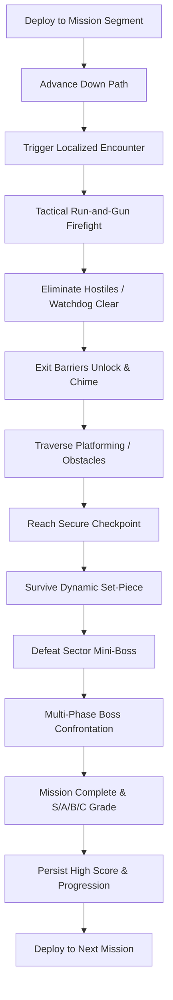

# Strike Vector — Game Design Document

## 1. Executive Summary
* **Title**: STRIKE VECTOR
* **Genre**: Modern 3D Forward-Moving Run-and-Gun Shooter
* **Platform**: Godot 4.3 Stable (GL Compatibility renderer, Web / Desktop / Mobile)
* **Design Philosophy**: Progression philosophy of classic arcade shooters: continuous forward advance through changing scenes, fighting location-specific enemies, overcoming obstacles, completing tactical objectives, reaching checkpoints, defeating mini-bosses, surviving set-pieces, conquering multi-phase bosses, and extracting safely.

---

## 2. Core Game Loop


---

## 3. Campaign Missions (8 Distinct Theaters)
1. **Mission 1: Urban Blackout**
   - *Flow*: Streets $\rightarrow$ Commercial Alleys $\rightarrow$ Mall Interior $\rightarrow$ Parking Structure $\rightarrow$ Rooftops $\rightarrow$ Evacuation Plaza.
   - *Mini-Boss*: Heavy Patrol Mech.
   - *Boss*: Assault VTOL Gunship with dual rocket pods.
2. **Mission 2: High-Speed Rail**
   - *Flow*: Terminal Concourse $\rightarrow$ High-Speed Passenger Cars $\rightarrow$ Moving Train Roof $\rightarrow$ Cargo Flats $\rightarrow$ Suspension Rail Bridge.
   - *Mini-Boss*: Armored Interceptor Drone.
   - *Boss*: Heavily Gunned Rail Cruiser Craft.
3. **Mission 3: Harbor Assault**
   - *Flow*: Container Terminals $\rightarrow$ Marine Warehouses $\rightarrow$ Gantry Crane Yard $\rightarrow$ Drydock Basin $\rightarrow$ Cargo Carrier Vessel.
   - *Mini-Boss*: Hydraulic Cargo Loader Mech.
   - *Boss*: Harbor Defense Cruiser Fortress.
4. **Mission 4: Desert Convoy**
   - *Flow*: Outpost Settlement $\rightarrow$ Canyon Pass $\rightarrow$ Armored Moving Convoy $\rightarrow$ Cracking Refinery $\rightarrow$ Pipeline Terminus.
   - *Mini-Boss*: Convoy Heavy Battle Tank.
   - *Boss*: Armored Land Crawler Locomotive.
5. **Mission 5: Arctic Installation**
   - *Flow*: Snowfield Outskirts $\rightarrow$ Fortress Perimeter $\rightarrow$ Sub-Zero Labs $\rightarrow$ Glacial Ice Cavern $\rightarrow$ Radar Missile Launchpad.
   - *Mini-Boss*: Cryo Autonomous Walker.
   - *Boss*: Sub-Zero Fortress Core Mech.
6. **Mission 6: Megafactory**
   - *Flow*: Logistic Freight Bays $\rightarrow$ Automated Assembly Line $\rightarrow$ Robotic Sorting Floor $\rightarrow$ Industrial Foundry Furnace $\rightarrow$ Cyber Control Center.
   - *Mini-Boss*: Industrial Overhead Crane Sentinel.
   - *Boss*: Automated Factory Core Unit.
7. **Mission 7: Sky Fortress**
   - *Flow*: Combat Drop Insertion $\rightarrow$ Exterior Catwalks $\rightarrow$ Fighter Hangar $\rightarrow$ High-Voltage Corridors $\rightarrow$ Plasma Reactor Deck $\rightarrow$ Command Deck.
   - *Mini-Boss*: Stealth Pursuit Drone.
   - *Boss*: Sky Fortress Airborne Command Citadel.
8. **Mission 8: Final Citadel**
   - *Flow*: Trench Breach $\rightarrow$ Bastion Vehicle Bay $\rightarrow$ Fortress Interior $\rightarrow$ Grand Spire Spindle $\rightarrow$ Multi-Phase Overlord Titan $\rightarrow$ Timed Aerial Extraction.
   - *Mini-Boss*: Praetorian Elite Commander.
   - *Boss*: Overlord Titan Mech (Multi-Phase: Kinetic Armor $\rightarrow$ Exposed Energy Core $\rightarrow$ Overdrive Meltdown).

---

## 4. Player Mechanics & Camera Systems
- **Locomotion**: CharacterBody3D with 0.15s coyote & jump buffering, sprint, crouch, slide-fire, dodge-roll, ledge mantling, anti-fall recovery plane.
- **Health & Armor**: 100 HP, 100 Shield Armor. Armor absorbs 60% of incoming damage before health depletion.
- **Camera Director**: SpringArm3D with raycast occlusion testing and 7 interpolation camera modes:
  1. `THIRD_PERSON_COMBAT` (Standard over-the-shoulder)
  2. `ADS_SHOULDER` (Tight zoom FOV 55)
  3. `SIDE_SCROLLER_25D` (Arcade run-and-gun lateral perspective)
  4. `FORWARD_CORRIDOR` (Direct forward-tracking corridor view)
  5. `VEHICLE_CHASE` (High-speed cinematic vehicle tracking)
  6. `BOSS_ARENA` (Elevated panoramic arena framing)
  7. `CINEMATIC_TRANSITION` (Scripted smooth transition framing)

---

## 5. Arsenal & Equipment
- **Weapons (9 Original Types)**:
  - `VX-7 Assault Rifle` (Automatic 30-round mag, balanced)
  - `Tempest SMG` (High RPM, 35-round mag, high agility)
  - `Breach Shotgun` (8 pellets, heavy spread close-quarters)
  - `Atlas Battle Rifle` (3-round burst, 24 rounds, marksman)
  - `Longshot Marksman` (High damage precision sniper, 8 rounds)
  - `Cyclone LMG` (100 rounds sustained fire, heavy suppression)
  - `Arc Launcher` (Explosive plasma orb, 6 rounds, AoE)
  - `Pulse Cannon` (Penetrating charged laser, 12 rounds)
  - `Tactical Sidearm` (Rapid backup pistol, 15 rounds, $\infty$ reserve)
- **Power Modules**: Rapid Fire, Spread Module, Piercing Module, Shield Overcharge, Overdrive, Support Drone.

---

## 6. AI Architecture
- **HFSM**: 10 distinct states (`IDLE`, `PATROL`, `SUSPICIOUS`, `INVESTIGATE`, `ALERT`, `COVER_FLANK`, `AIM`, `ATTACK`, `REPOSITION`, `SEARCH`).
- **Squad Coordinator**: Distributed attack token pool ($N=3$) and lateral flanking slot assignments to prevent chaotic dogpiles.
- **Perception**: Dynamic Field of View ($110^\circ$), raycast LOS, acoustic hearing events.
- **Deterministic Watchdog**: 28-second watchdog timer prevents progression deadlocks caused by lost or geometry-stuck enemies.
- **Navigation Mesh**: Programmatic `NavigationRegion3D` generation provides walkable navigation polygons across roadway and pedestrian corridors for authentic pathfinding.

---

## 7. Tactical Navigation & HUD Architecture
- **Top-Center Compass Tape**: Real-time degree heading with cardinal markers ($N, NE, E, SE, S, SW, W, NW$) and dynamic objective diamond bearing with range readout (`[◆ JAMMER 128m]`).
- **Top-Right Radar Minimap**: Circular planar radar tracking player position and forward orientation, road corridor boundaries, objective beacons, and threat-aware hostile blips with a 3.0-second fade timer.
- **Full Tactical Map (M Key)**: Modal schematic providing bird's-eye view of corridor milestones, active checkpoints, and extraction zones.
- **Combat Crosshair Convergence**: Camera center raycast calculates 3D point-of-aim at reticle hit, dynamically rotating projectile trajectory from weapon muzzle to impact point, eliminating low-cover clipping.
- **Directional Threat Indicators**: `StrikeDirectionalDamageIndicator` calculates the screen-space angular bearing of attackers, rendering glowing threat arcs around the reticle and pulsing a red peripheral vignette on damage.

---

## 8. World Scale & Environmental Storytelling
- **Metric Scale Standard**: 1 Godot unit = 1 metre convention enforced throughout all assets.
  - Human Operative: $1.80\text{m}$ height, $0.40\text{m}$ radius capsule.
  - Vehicles: Authentic proportions: Enforcer patrol cruiser $4.56\text{m} \times 2.08\text{m} \times 2.0\text{m}$; Heavy utility truck $6.16\text{m} \times 3.3\text{m} \times 3.19\text{m}$.
  - Street Hierarchy: $14.0\text{m}$ wide two-lane asphalt roadway with $3.5\text{m}$ sidewalks ($21.0\text{m}$ total canyon width), enclosed by $14\text{m}\text{--}24\text{m}$ multi-story buildings.
- **Blackout Atmosphere**:
  - Deep midnight sky lighting (energy $0.35$, directional moonlight $0.85$) with atmospheric distance fog (density $0.0035$).
  - Dark grimy concrete facades and weathered carbon steel replacing bright pastel townhouses.
  - Blinking orange/red hazard beacons on roadblocks and disabled emergency vehicle lightbars.
  - Disabled commercial neon signage, burning debris, and selective emergency lighting.

---

## 9. Drift Storm — Arcade Kart Racing (Title 4)

### 9.1 Title Overview & Core Gameplay Loop
* **Title**: DRIFT STORM
* **Genre**: High-Octane Arcade Kart Racing
* **Platform**: Godot 4.3 Stable (GL Compatibility, Desktop & Web)
* **Core Loop**:
  ```mermaid
  graph TD
      Select[Select Vehicle & Circuit] --> Grid[Grid Spawn & Starting Light Gantry]
      Grid --> Countdown[3-2-1-GO Simultaneous Release]
      Countdown --> Race[3-Lap Multi-Tier Competition]
      Race --> Drift[Powerslide & Mini-Turbo Generation]
      Drift --> Overtake[Slipstream & Overtake Competitors]
      Overtake --> Gates[Continuous Checkpoint Progression]
      Gates --> Lap[Complete 3 Laps]
      Lap --> Finish[Checkered Flag & Final Results]
      Finish --> Podium[Podium Ceremony & Leaderboard Save]
  ```

### 9.2 Authoritative RaceSpline & Track Hierarchy
All race mechanics derive strictly from a single authoritative `RaceSpline` model:
- Dense arc-length sample cache ($0.5\text{m}$ resolution) providing centerline position $\vec{P}(s)$, forward tangent $\vec{T}(s)$, surface normal $\vec{N}(s)$, lateral binormal $\vec{B}(s)$, and drivable width bounds.
- Eliminates fragmented logic across collision, AI navigation lines, wrong-way detection, minimap generation, and position tracking.
- Watertight collision generated via continuous road foundations with zero internal seams or collision steps.

### 9.3 Three Production Circuits
1. **Volt Speedway**: Professional Grand Prix stadium raceway ($755\text{m}$, 504 samples), high-speed pit straight, start/finish gantry, spectator grandstands, Armco barriers, asphalt ribbon with blue/white kerb strips, chicane and banked hairpin.
2. **Canyon Run**: Rugged mountain desert circuit ($848\text{m}$, 566 samples), red-rock sandstone formations, mountain tunnels, elevation changes, wooden crash rails, and gravel runoff.
3. **Skyline Drift**: High-tech metropolis night circuit ($812\text{m}$, 542 samples), elevated highway overpasses, neon-lit skyscrapers, tight $90^\circ$ and $180^\circ$ drift bends, concrete barriers, and street lighting.

### 9.4 Vehicle Archetypes & 4-Wheel Physics
- **4 Archetypes**:
  - *Phantom*: Top speed $30\text{ m/s}$, mass $750\text{ kg}$, straight-line specialist.
  - *Enforcer*: High acceleration $28\text{ m/s}^2$, mass $920\text{ kg}$, corner exit torque.
  - *Drifter*: Drift boost multiplier $1.35$, steering $3.0\text{ rad/s}$, mini-turbo master.
  - *All-Rounder*: Balanced attributes ($26\text{ m/s}$ top speed, $25\text{ m/s}^2$ accel) for all circuits.
- **Physics Suspension**: 4 physical raycasts at wheel contact patches with spring-damper compression ($0.28\text{m}$ rest, $0.12\text{m}$ travel), rolling wheel animation ($\omega = v/r$), front wheel steering yaw ($\pm 28^\circ$), and zero hover ($y = 0.08\text{m}$ chassis rest).
- **Telemetry System**: Real-time tracking of `wheel_contact_count`, `ground_distance`, `suspension_compression`, `surface_normal`, `vehicle_speed`, and `nearest_spline_distance`.

### 9.5 Authoritative Wrong-Way System
- Continuous planar projection of forward vector $\vec{F}$ against spline tangent $\vec{T}$.
- Triggers **ONLY** when: $\vec{F} \cdot \vec{T} < -0.30$, forward speed $>3.0\text{ m/s}$, vehicle is within track corridor, and condition persists $>0.6\text{s}$.
- Rapid decay hysteresis and immediate auto-clearance upon facing forward. Zero false warnings on valid clockwise laps.

### 9.6 AI Competitors & HUD
- **AI Navigation**: Curvature-aware lookahead steering ($10\text{--}26\text{m}$), trail-braking, lateral lane separation, slipstream draft overtaking, and stuck watchdog unjamming.
- **Dynamic Minimap Canvas**: 64-sample vector track ribbon with player chevron, finish line, and real-time color-coded opponent markers derived directly from `RaceSpline`.
- **Race Position**: Continuous distance-based progress sorting: $\text{prog} = (\text{lap}-1) \cdot L + s$.

