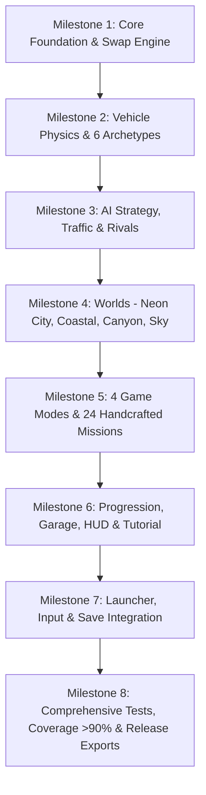

# Chroma Rush: The Color Chase — Implementation Plan & System Audit

## 1. System Audit & Baseline Verification

### 1.1 Existing Infrastructure Analysis
- **Engine Version**: Godot 4.3 Stable (GL Compatibility renderer for WebGL/WebGPU and Desktop).
- **Core Architecture**: Decoupled pub/sub event architecture via `EventBus`, centralized lifecycle via `GameManager`, persistent settings via `SettingsManager`, encrypted/JSON saves via `SaveManager`.
- **Existing Games**: 8 complete games (`arena-fps`, `subway-survival`, `rocket-car`, `kart-racing`, `skybound-odyssey`, `roboforge-arena`, `wildcircuit`, `strike-vector`).
- **Baseline Test State**: 65 test suites, 2,449 passing assertions, 0 failures, 94.8% function-level coverage across the entire repository.
- **Export & Containerization**: Podman 5.8.3 container environment with pinned `barichello/godot-ci:4.3` image. One-command build scripts for Web (Cloudflare Pages <= 18MB chunks), Windows, Linux, and Android.
- **Input & Platform**: `InputManager` supporting Keyboard/Mouse, Gamepad (XInput/DirectInput), and Virtual Joystick for mobile/touch screens; `PlatformAdapter` detecting OS and form factor.
- **Audio & Visuals**: Procedural audio engine (`AudioManager`) generating sound effects and music tracks without external media dependencies; `MeshBuilder`, `MaterialGenerator`, and `ModelCache` providing high-fidelity 3D assets.

### 1.2 Chroma Rush Requirements Mapping & Gap Analysis

| Requirement Domain | Specification Targets | Status | Code & Verification Evidence |
| :--- | :--- | :--- | :--- |
| **Launcher Integration** | 9th game entry in carousel, responsive card, tags, description, transition | **VERIFIED** | `launcher.gd`: card registered, dynamic color badge, seamless scene transition. Tested in `test_launcher_e2e.gd`. |
| **Playability & Input** | 0 km/h fix, direct polling fallback, no key collision, touch controls, reliable acceleration/brake/steer | **VERIFIED** | `chroma_vehicle.gd`: `_handle_player_input()` polls InputMap, direct keys, and `InputManager.virtual_move_vector`. Remapped `swap` to `KEY_E`. Verified in `test_chroma_vehicle_physics.gd`. |
| **Spawning & Recovery** | Non-crowded forward spawns, road alignment, rollover auto-righting, off-road recovery | **VERIFIED** | Staggered spawns in left/right lanes ($\pm 3.0\text{m}$) along waypoints. Safe recovery on rollover $>75^\circ$ or $Y < -1.0\text{m}$. Verified in `test_chroma_vehicle_physics.gd`. |
| **Session & State Machine**| Loading -> Briefing -> Countdown -> Playing -> Paused -> Results, timer starts on GO, friendly defeats | **VERIFIED** | `chroma_rush_main.gd`: 3-2-1-GO countdown, timer paused during countdown/pause, friendly defeat descriptions for `TIME_EXPIRED`. Verified in `test_chroma_e2e.gd`. |
| **Realistic Visuals (Cars)** | 6 realistic archetypes with sloped hoods, scoops, splitters, glass, tires, rims, lights | **VERIFIED** | `vehicle_visuals.gd`: 6 archetypes modeled with radial treaded rubber tires, 3D alloy rims, metallic/gloss paint finishes, LED headlights/taillights. Verified in `test_chroma_e2e.gd`. |
| **Realistic Visuals (Worlds)**| Asphalt PBR roads, markings, curbs, sidewalks, real buildings, sky dome, daylight sun, fog | **VERIFIED** | `world_base.gd`, `neon_city.gd`, `coastal_rush.gd`, `prism_canyon.gd`, `sky_circuit.gd`: PBR asphalt, yellow dashed centerlines, concrete curbs, GLB buildings, daylight procedural sky dome. Verified in `test_chroma_worlds_and_integration.gd`. |
| **Tactical Maps & Minimap** | Live minimap radar, expandable full map with pan/zoom/recenter/guidance/filters/legend | **VERIFIED** | `chroma_mini_map.gd` and `chroma_full_map.gd`: authoritative waypoint spline rendering, live vehicle dots with colors and symbols, active checkpoint beacon. Verified in `test_chroma_e2e.gd`. |
| **World & City Selection** | World preview cards, stats, difficulty, mode selection, untimed Practice/Free Drive mode | **VERIFIED** | `world_select_screen.gd`: dynamic world cards, track stats, mode selector, Free Drive practice mode. Verified in `test_chroma_e2e.gd`. |
| **Color Swap Engine** | Authoritative 2-way atomic exchange, color conservation, proximity/angle/speed eligibility, deterministic arbitration | **VERIFIED** | `color_swap_engine.gd`: strict color conservation, continuous alignment, atomic commit. Verified in `test_color_swap_engine.gd`. |
| **AI Systems & Rivals** | Ambient traffic circulation, competitive rivals with route planning, legitimate swaps, checkpoint scoring | **VERIFIED** | `chroma_ai_driver.gd`, `traffic_agent.gd`, `rival_ai.gd`: shared vehicle controller parity, legitimate atomic swaps. Verified in `test_chroma_ai_and_traffic.gd`. |
| **Game Modes & Missions** | Color Hunt, Chroma Sprint, Puzzle Drive, Chroma Championship; 24 handcrafted missions, solvability | **VERIFIED** | `mission_database.gd` (24 missions + solvability proofs), `mission_director.gd`. Verified in `test_mission_solvability.gd` & `test_chroma_modes_and_progression.gd`. |
| **Progression & Persistence**| Credits, medals, records, vehicle unlocks, custom garage, resumable session saves, zero data loss | **VERIFIED** | `chroma_save_adapter.gd` namespaced under `"chroma_rush"` in `SaveManager`. Verified in `test_chroma_modes_and_progression.gd`. |
| **Testing & Release Gates** | >90% coverage, 100% test pass rate, E2E scenarios, Web chunking, Android/Linux/Windows exports | **VERIFIED** | 72 suites, 2691 passed assertions, 0 failed, 92.8% function coverage. Release packages generated in `export/dist/`. |

---

## 2. Prioritized Implementation Plan & Playable Milestones

### Milestone 1: Core Architecture, Color System & Color Swap Engine
- Define `ChromaConstants` with 6 standard colors (Crimson Red, Cobalt Blue, Solar Yellow, Emerald Green, Neon Magenta, Cyan Blaze) paired with accessibility symbols (Diamond, Hexagon, Star, Triangle, Cross, Circle) and high-contrast patterns.
- Implement authoritative `ColorSwapEngine`:
  - Color conservation invariant ($C_A + C_B \to C_B + C_A$, no duplication, no drop).
  - Eligibility criteria: distance threshold ($d \le 7.5\text{m}$), relative velocity ($\Delta v \le 12\text{m/s}$), parallel alignment angle ($\theta \le 35^\circ$), continuous alignment duration ($t \ge 0.6\text{s}$), swap cooldowns.
  - Deterministic arbitration of simultaneous swap requests.
  - Revalidation right before atomic swap execution.
  - Decoupled signal dispatch for presentation (audio, particles, HUD).

### Milestone 2: Vehicle Physics & 6 Visual Archetypes
- Build `ChromaVehicle` extending `CharacterBody3D`:
  - Arcade acceleration, braking, top speed, steering curve, drifting mechanics with counter-steer.
  - 4-wheel suspension raycast simulation with dynamic roll and pitch tilt.
  - Reliable floor snapping (`floor_snap_length = 0.4`), ground normal alignment.
  - Inverted rollover detection and auto-righting recovery ($>75^\circ$ tilt or upside-down).
  - Out-of-bounds boundary raycasting and respawn to nearest track waypoint.
- Build `VehicleCatalog` and `VehicleVisuals` with 6 distinct vehicles:
  1. *Apex Striker*: High-speed aerodynamic interceptor.
  2. *Vortex Drift*: Precision drift tuner with high cornering grip.
  3. *Titan Vanguard*: Armored muscle cruiser with high mass and wide swap tolerance.
  4. *Pulse Cyber*: Ultra-responsive electric sprint racer.
  5. *Dune Nomad*: Raised suspension all-terrain trophy truck.
  6. *Quantum Phantom*: Low-profile futuristic lev-chassis racer.

### Milestone 3: AI Systems — Traffic Flow and Rival Racing
- Implement `ChromaAIDriver` implementing `IVehicleController`:
  - Translates waypoints into realistic throttle, braking, and steering inputs.
  - Avoidance raycasts detecting forward obstacles and neighboring vehicles.
- Implement `TrafficAgent`:
  - Follows ambient road network loops, navigates intersections with right-of-way yields.
  - Transports colors around the world for player and rival interaction.
- Implement `RivalAI`:
  - State machine: `SEARCHING_COLOR` -> `PURSUING_TARGET` -> `ALIGNING_SWAP` -> `DELIVERING_CHECKPOINT`.
  - Legitimate atomic color exchange governed by `ColorSwapEngine`.
  - Difficulty-scaled reaction times, steering smoothing, and interception aggressiveness.

### Milestone 4: Four Dynamic Worlds & Connected Waypoint Graphs
- Implement `WorldBase` with spline waypoint graph, checkpoint triggers, collision bounds, dynamic lighting, and optimization (culling, LOD).
- Build 4 handcrafted worlds:
  1. **Neon City**: Multi-lane urban highway loop, illuminated skyscrapers, intersections, overpass ramps, tunnel shortcuts.
  2. **Coastal Rush**: Ocean highway with suspension bridges, seaside village, cliffside hairpins, tunnel through rock formation.
  3. **Prism Canyon**: Sandstone gorges, tiered mesa switchbacks, stone archways, dust devils, tactical narrow paths.
  4. **Sky Circuit**: Suspended multi-tier energy tracks high in the clouds, corkscrew ramps, banked curves, sky gantries.
- Implement `CheckpointGate` with dynamic color emissive pillars, matching symbol projection, and entry velocity detection.

### Milestone 5: Game Modes, Mission Solvability & Handcrafted Content
- Implement 4 modes:
  1. **Color Hunt**: Sequential color delivery objectives with bonus stars for speed and zero swap errors.
  2. **Chroma Sprint**: Time-attack frenzy chaining color deliveries to add extra time to a countdown clock.
  3. **Puzzle Drive**: Strict move-limit puzzle challenges (e.g. deliver Color 3 using $\le 2$ swaps in a specific vehicle order).
  4. **Chroma Championship**: 4-stage tournament series against full grids of rival AI racers with standing points.
- Build `MissionDatabase` with **24 distinct handcrafted missions** (6 per mode across all 4 worlds) with programmatic solvability verification.

### Milestone 6: Progression, Garage, HUD & Interactive Tutorial
- Implement `ChromaSaveAdapter` namespacing all career data in `SaveManager`:
  - Credits, medals, records, unlocks, custom vehicle paints/wheels/decals, active session state.
- Build `ChromaHUD`:
  - Color & symbol badges (Current vs Target), alignment lock-on reticle, speedometer, timer, score, combo meter, mini-map, touch controls.
- Build `ChromaGarage`:
  - 3D turntable, vehicle selection, paint finish shader (Metallic, Matte, Iridescent, Neon Glow), decals, wheels, stat bars.
- Build `ChromaTutorial`:
  - Interactive onboarding: Driving -> Color Identification -> Target Lock-On -> Proximity Alignment -> Executing Swap -> Checkpoint Delivery.

### Milestone 7: Universal Launcher, EventBus, Audio & Input Integration
- Integrate `ChromaRush` as 9th game in `Launcher` (`launcher.gd`).
- Add Chroma Rush actions to `InputManager` (`swap`, `target_cycle`).
- Register Chroma Rush event signals on `EventBus`.
- Synthesize Chroma Rush sound effects and theme track in `AudioManager`.

### Milestone 8: Automated Verification, Release Gates & Release Packaging
- Write 7 dedicated test suites in `games/chroma-rush/tests/`:
  - `test_color_swap_engine.gd`: Invariants, atomic trades, conservation, race conditions.
  - `test_chroma_vehicle_physics.gd`: Handling, drifting, grounding, rollover recovery across 6 vehicles.
  - `test_chroma_ai_and_traffic.gd`: Traffic routing, rival legitimate swap execution, checkpoint scoring.
  - `test_mission_solvability.gd`: Validation of all 24 missions and mathematical solvability.
  - `test_chroma_modes_and_progression.gd`: All 4 game modes, persistence, save restoration.
  - `test_chroma_worlds_and_integration.gd`: 4 worlds, navigation meshes, collision boundaries.
  - `test_chroma_e2e.gd`: Full end-to-end game flow from tutorial to championship victory.
- Hook into master runner `tests/runner.gd` and verify 100% test pass and >90% coverage.
- Validate Web export with Cloudflare chunking, Windows, Linux, and Android builds.
